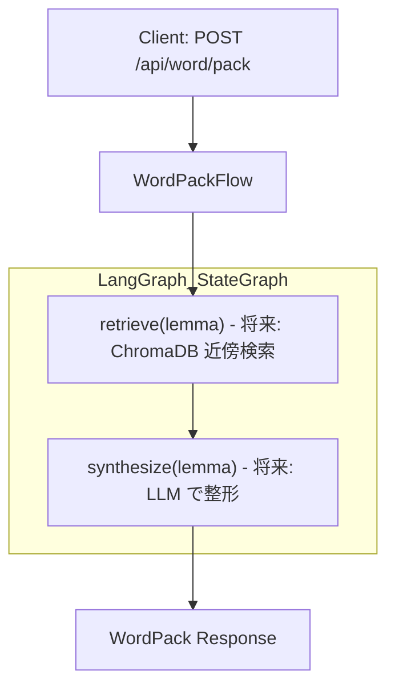
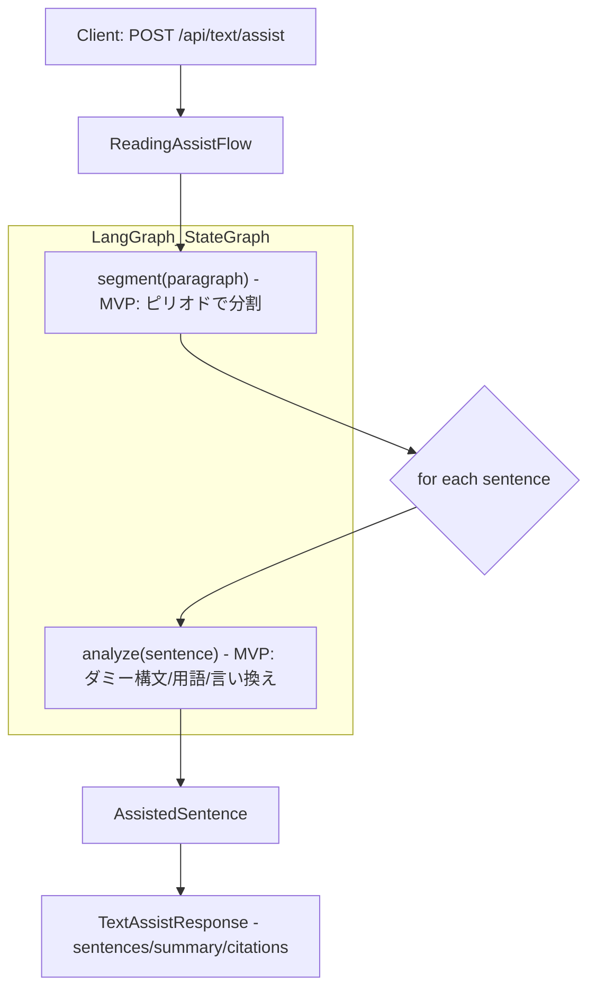
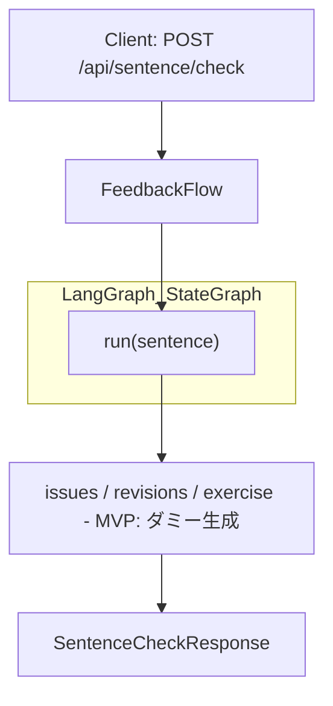

# WordPack for English

英単語トレーナー（LLM×RAG×LangGraph）MVP。技術・科学英文の読み・用法・発音の理解を支援します。リポジトリはバックエンド（FastAPI）とフロントエンド（React + Vite）のモノレポ構成です。

## 特徴
- バックエンド: FastAPI、構成・ルータ・簡易ログ、テストあり
- フロントエンド: React + TypeScript + Vite、単一ページ/4パネル構成（カード/自作文/段落注釈/設定）
- 今後の実装: LangGraph フロー、RAG（ChromaDB）、SRS、発音変換（cmudict/g2p-en→IPA）

---

## 1. クイックスタート

### 1-1. 前提
- Python 3.11+ 推奨（requirementsは軽量）
- Node.js 18+ / pnpm or npm / (Vite)

### 1-2. 依存インストール
```bash
# Python
python -m venv .venv
. .venv/Scripts/activate  # Windows PowerShell: .venv\Scripts\Activate.ps1
pip install -r requirements.txt

# Frontend
cd src/frontend
npm install
```

### 1-3. バックエンド起動
```bash
# リポジトリルートで
python -m uvicorn backend.main:app --reload --app-dir src
```
- 既定ポート: `http://127.0.0.1:8000`
- ヘルスチェック: `GET /healthz`

### 1-4. フロントエンド起動
```bash
cd src/frontend
npm run dev
```
- 既定ポート: `http://127.0.0.1:5173`
- 開発時（別ポート）の呼び分け:
  - 方法A: `Settings` パネルの API Base を `http://127.0.0.1:8000/api` に設定
  - 方法B: Viteのプロキシ（既定）を利用し、API Base はデフォルトの `/api` のまま

### 1-5. Docker で一括起動（推奨・ホットリロード対応）
```bash
# リポジトリルートで
docker compose up --build
```
- バックエンド: http://127.0.0.1:8000
- フロントエンド: http://127.0.0.1:5173
- ホットリロード:
  - backend: `uvicorn --reload` + ボリュームマウント `.:/app`
  - frontend: Vite dev サーバ + ボリュームマウント `src/frontend:/app`
- フロントからの API 呼び出しは Vite のプロキシ設定で `http://backend:8000` に転送されます。

Tips (Windows)：Vite のファイル監視が不安定な場合、`CHOKIDAR_USEPOLLING=1` を環境変数に設定してください（compose の service へ追加可能）。

---

## 2. ディレクトリ構成（抜粋）
```
app/                     # 追加のサンプルFastAPIアプリ（静的配信デモ等）
src/backend/             # 本番用FastAPIアプリ
  main.py                # ルータ登録/ログ初期化
  config.py              # 環境設定（pydantic-settings）
  logging.py             # structlog設定
  routers/               # エンドポイント群
  flows/                 # LangGraphベースの処理(プレースホルダ)
  models/                # pydanticモデル(プレースホルダ)
src/frontend/            # React + Vite
  src/components/        # 4パネルのコンポーネント
  src/SettingsContext.tsx
static/                  # 最小UIの静的ファイル（`app/main.py`用）
```

---

## 3. API 概要（MVP現状）
FastAPI アプリは `src/backend/main.py`。

- `GET /healthz`
  - ヘルスチェック。レスポンス: `{ "status": "ok" }`

- `POST /api/word/pack`
  - 周辺知識パック生成（MVP: スキーマ準拠の最小返却 + 簡易発音）。
  - 発音は暫定規則ベースで `pronunciation.ipa_GA`、`syllables`、`stress_index` を付与。
  - レスポンス例（抜粋）:
    ```json
    {
      "lemma": "converge",
      "pronunciation": {"ipa_GA":"/kɒnverge/","syllables":2,"stress_index":0,"linking_notes":[]},
      "senses": [{"id":"s1","gloss_ja":"意味（暫定）","patterns":[]}],
      "collocations": {"general": {"verb_object": [], "adj_noun": [], "prep_noun": []}, "academic": {"verb_object": [], "adj_noun": [], "prep_noun": []}},
      "contrast": [],
      "examples": {"A1": ["converge example."], "B1": [], "C1": [], "tech": []},
      "etymology": {"note":"TBD","confidence":"low"},
      "study_card": "この語の要点（暫定）。"
    }
    ```

- `GET /api/word`
  - 単語情報取得（プレースホルダ）。
  - レスポンス例: `{ "definition": null, "examples": [] }`

- `POST /api/sentence/check`
  - 自作文チェック（MVP: issues/revisions/exercise をダミー生成）。
  - レスポンス例（抜粋）:
    ```json
    { "issues": [{"what":"語法","why":"対象語の使い分け不正確","fix":"共起に合わせて置換"}],
      "revisions": [{"style":"natural","text":"..."}],
      "exercise": {"q":"Fill the blank: ...","a":"..."} }
    ```

- `POST /api/text/assist`
  - 段落注釈（MVP: ピリオド分割 + 簡易構文/語注/パラフレーズ）。
  - レスポンス例（抜粋）:
    ```json
    { "sentences": [{"raw":"Some text","terms":[{"lemma":"Some"}]}], "summary": null, "citations": [] }
    ```

- `GET /api/review/today`
  - 本日の復習アイテム取得（プレースホルダ）。
  - レスポンス例: `{ "detail": "review retrieval pending" }`

- `POST /api/review/grade`
  - 復習アイテムの採点（プレースホルダ）。
  - レスポンス例: `{ "detail": "review grading pending" }`

補足:
- ルータのプレフィックスは `src/backend/main.py` で設定されています。
- `flows/*` は LangGraph 依存の最小実装（将来差し替え可能）です。

---

## 4. フロントエンド UI 概要
単一ページで以下の4タブを切替。最小スタイル・セマンティックHTMLを志向。

- カード（`CardPanel.tsx`）
  - `カードを取得` で本日の一枚を取得（MVPではダミー）、`復習` で採点
  - 使用API: `GET {apiBase}/review/today`, `POST {apiBase}/review/grade`

- 自作文（`SentencePanel.tsx`）
  - 文入力→`チェック`。使用API: `POST {apiBase}/sentence/check`
  - 返却された `issues/revisions/exercise` を画面に表示

- 段落注釈（`AssistPanel.tsx`）
  - 段落入力→`アシスト`。使用API: `POST {apiBase}/text/assist`
  - 返却された `sentences/summary` を画面に表示

- 設定（`SettingsPanel.tsx`）
  - API Base の入力のみ（デフォルト `/api`）。

アクセシビリティ/操作:
- Alt+1..4 でタブ切替、`/` で主要入力へフォーカス
- ローディング中は `role="status"`、エラーは `role="alert"`

---

## 5. テスト
`pytest` による API の基本動作テストが含まれます。
```bash
pytest -q
```
- テストは `tests/test_api.py`。LangGraph/Chroma のスタブを挿入して起動します。

---

## 6. 設定/環境変数
- `src/backend/config.py`
  - `environment`, `llm_provider`, `embedding_provider`
  - `.env` を読み込みます。
- `app/config.py`
  - `api_key`, `allowed_origins`（カンマ区切り対応）

---

## 7. 開発メモ（現状とTODO）
- フロントエンドAPIパスの整合: Sentence/Assist は `/api/*` に統一済み
- LangGraph フロー実装
  - `flows/word_pack.py`, `flows/reading_assist.py`, `flows/feedback.py`（MVPダミー）
- RAG(ChromaDB) と埋め込み/LLMプロバイダ
  - `backend/providers.py` のプロバイダ実装
- SRS/発音
  - `app/srs.py`, `app/pronunciation.py` は未実装（NotImplemented）
- CORS/タイムアウト/メトリクス
  - `app/main.py` にサンプル実装あり。必要に応じて `src/backend` に移植

---

## 8. ライセンス
TBD

---

## 9. 付録: LangGraph ベースのAI処理フロー（Mermaid）

### 9-1. WordPackFlow（語彙パック生成）


### 9-2. ReadingAssistFlow（リーディング支援）


### 9-3. FeedbackFlow（自作文フィードバック）
