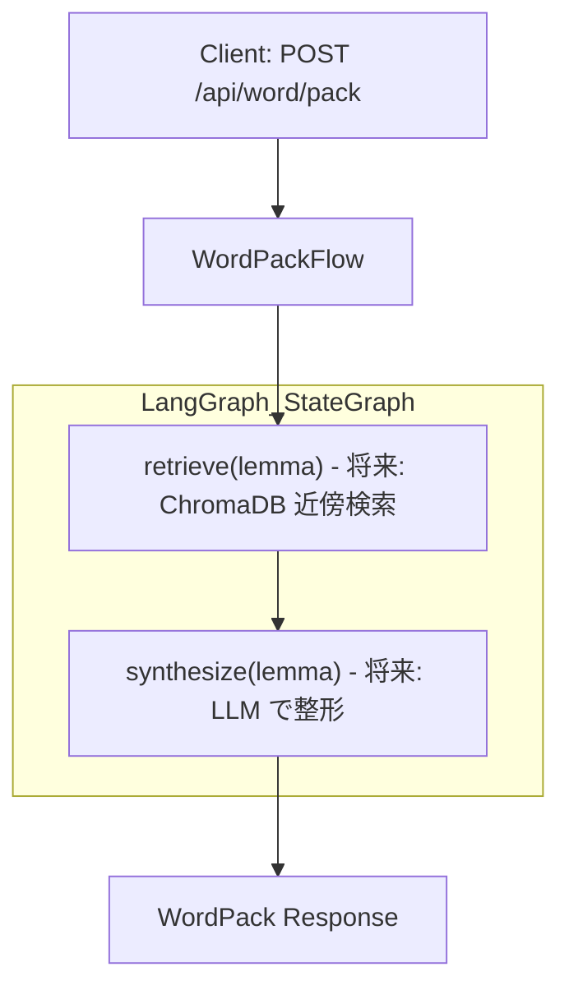
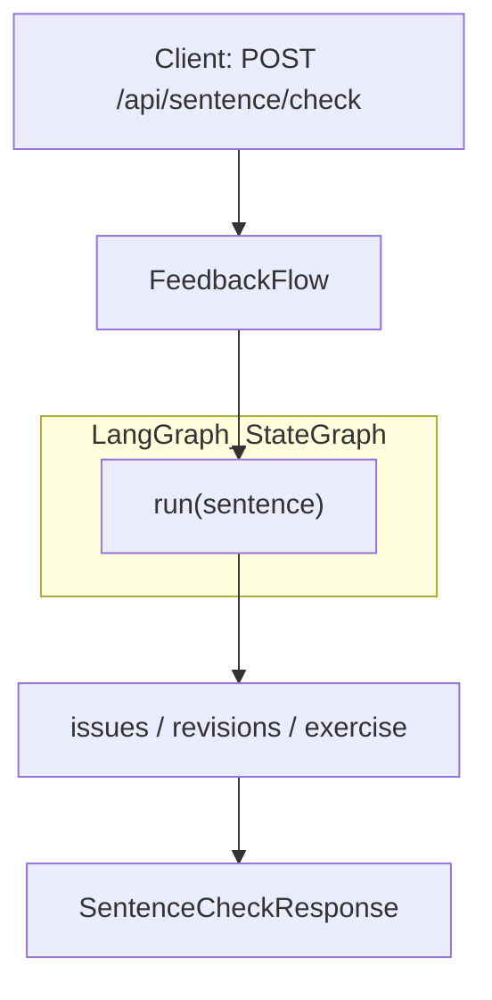

# WordPack for English

英単語トレーナー（LLM×RAG×LangGraph）。技術・科学英文の読み・用法・発音の理解を支援します。リポジトリはバックエンド（FastAPI）とフロントエンド（React + Vite）のモノレポ構成です。

## 特徴
- バックエンド: FastAPI、構成・ルータ・簡易ログ、テストあり
- フロントエンド: React + TypeScript + Vite、単一ページ/5パネル構成（カード/自作文/段落注釈/WordPack/設定）
- SRS（簡易SM-2, SQLite 永続化）: 今日のカード取得・3段階採点・進捗統計（今日の提案数/残数・最近5件）に対応（M6）
  - よく見る順（人気）APIを追加: `GET /api/review/popular?limit=10`（フロントのインデックスに反映）
- 発音強化（M5）: cmudict/g2p-en による IPA・音節・強勢推定（例外辞書・辞書キャッシュ・タイムアウト付きフォールバック）
- WordPack 再生成の粒度指定（M5）: 全体/例文のみ/コロケのみ の選択（Enum化済み）

---

## 1. クイックスタート

### 1-1. 前提
- Python 3.11+ 推奨（requirementsは軽量）
- Node.js 18+ / pnpm or npm / (Vite)

### 1-2. 依存インストール
```bash
# Python
python -m venv .venv
. .venv/Scripts/activate  # Windows PowerShell: .venv\Scripts\Activate.ps1
pip install -r requirements.txt  # M5: 発音で cmudict / g2p-en を使用

# Frontend
cd src/frontend
npm install
```

### 1-3. RAG 用インデクスの準備（M3/PR3）
```bash
# 任意: 初回のみ、最小シードを投入（ChromaDB, 既定は settings.chroma_persist_dir）
python -m backend.indexing

# JSONL から投入する場合（例）
python -m backend.indexing \
  --word-jsonl data/word_snippets.jsonl \
  --terms-jsonl data/domain_terms.jsonl

# 永続ディレクトリを上書きする場合
python -m backend.indexing --persist .chroma
```

### 1-4. バックエンド起動
```bash
# リポジトリルートで
python -m uvicorn backend.main:app --reload --app-dir src
```
- 既定ポート: `http://127.0.0.1:8000`
- ヘルスチェック: `GET /healthz`

### 1-5. フロントエンド起動
```bash
cd src/frontend
npm run dev
```
- 既定ポート: `http://127.0.0.1:5173`
- 開発時（別ポート）の呼び分け: Vite のプロキシ（既定）により接続設定は不要です。フロントからは相対パス `/api` で呼び出します。

### 1-6. Docker で一括起動（推奨・ホットリロード対応）
```bash
# リポジトリルートで
docker compose up --build
```
- バックエンド: http://127.0.0.1:8000
- フロントエンド: http://127.0.0.1:5173
- ホットリロード:
  - backend: `uvicorn --reload` + ボリュームマウント `.:/app`
  - frontend: Vite dev サーバ + ボリュームマウント `src/frontend:/app`
- フロントからの API 呼び出しは Vite のプロキシ設定で `http://backend:8000` に転送されます。

Tips (Windows)：Vite のファイル監視が不安定な場合、`CHOKIDAR_USEPOLLING=1` を環境変数に設定してください（compose の service へ追加可能）。

---

## 2. ディレクトリ構成（抜粋）
```
app/                     # 追加のサンプルFastAPIアプリ（静的配信デモ等）
src/backend/             # 本番用FastAPIアプリ
  main.py                # ルータ登録/ログ初期化
  config.py              # 環境設定（pydantic-settings）
  logging.py             # structlog設定
  routers/               # エンドポイント群
  flows/                 # LangGraphベースの処理
  models/                # pydanticモデル（厳密化済み: Enum/Field制約/例）
  pronunciation.py       # 発音（cmudict/g2p-en優先・例外辞書/キャッシュ/タイムアウト付き）
src/frontend/            # React + Vite
  src/components/        # 4パネルのコンポーネント
  src/SettingsContext.tsx
static/                  # 最小UIの静的ファイル（`app/main.py`用）
```

---

## 3. API 概要
FastAPI アプリは `src/backend/main.py`。

- `GET /healthz`
  - ヘルスチェック。レスポンス: `{ "status": "ok" }`

- `GET /metrics`
  - 運用メトリクスのスナップショット。パス別に `p95_ms`, `count`, `errors`, `timeouts` を返す（M6）。

- `POST /api/word/pack`
  - 周辺知識パック生成（RAG: Chroma から近傍を取得し `citations` と `confidence` を付与）。
  - 発音: 実装は `src/backend/pronunciation.py` に一本化。cmudict/g2p-en を優先し、例外辞書・辞書キャッシュ・タイムアウトを備えた規則フォールバックで `pronunciation.ipa_GA`、`syllables`、`stress_index` を付与。
  - リクエスト例（M5 追加パラメータ・Enum化）:
    ```json
    { "lemma": "converge", "pronunciation_enabled": true, "regenerate_scope": "all" }
    ```
    - `pronunciation_enabled`: 発音情報の生成 ON/OFF（既定 true）
    - `regenerate_scope`: `all` | `examples` | `collocations`（Enum）。
  - レスポンス例（抜粋）:
    ```json
    {
      "lemma": "converge",
      "pronunciation": {"ipa_GA":"/kənvɝdʒ/","syllables":2,"stress_index":1,"linking_notes":[]},
      "senses": [{"id":"s1","gloss_ja":"意味（暫定）","patterns":[]}],
      "collocations": {"general": {"verb_object": [], "adj_noun": [], "prep_noun": []}, "academic": {"verb_object": [], "adj_noun": [], "prep_noun": []}},
      "contrast": [],
      "examples": {"A1": ["converge example."], "B1": [], "C1": [], "tech": []},
      "etymology": {"note":"N/A","confidence":"low"},
      "study_card": "この語の要点（暫定）。",
      "citations": [],
      "confidence": "low"
    }
    ```

  

- `POST /api/sentence/check`
  - 自作文チェック（RAG 引用と `confidence` を付与、将来LLM統合）。
  - レスポンス例（抜粋）:
    ```json
    { "issues": [{"what":"語法","why":"対象語の使い分け不正確","fix":"共起に合わせて置換"}],
      "revisions": [{"style":"natural","text":"..."}],
      "exercise": {"q":"Fill the blank: ...","a":"..."} }
    ```

- `POST /api/text/assist`
  - 段落注釈（RAG: 先頭語で `domain_terms` を近傍検索し `citations` と `confidence` を付与）。簡易要約を返却。
  - レスポンス例（抜粋）:
    ```json
    { "sentences": [{"raw":"Some text","terms":[{"lemma":"Some"}]}], "summary": null, "citations": [] }
    ```

- `GET /api/review/today`
  - 本日の復習カード（最大5枚）を返します。
  - レスポンス例:
    ```json
    { "items": [ { "id": "w:converge", "front": "converge", "back": "to come together" } ] }
    ```

- `POST /api/review/grade`
  - 復習カードの採点を記録。簡易SM-2で次回出題時刻を更新。
  - リクエスト例: `{ "item_id": "w:converge", "grade": 2 }`（2=正解,1=部分的,0=不正解）
  - レスポンス例: `{ "ok": true, "next_due": "2025-01-01T12:34:56.000Z" }`
  - 実装: `src/backend/srs.py`（SQLite 永続化）。復習履歴は `reviews` テーブルに保存され、同時実行はトランザクションで保護されます。

- `POST /api/review/grade_by_lemma`
  - レンマ（例: `"converge"`）を指定して採点。カード未存在時は自動作成。
  - 自動作成の仕様: `id = "w:<lemma>"`, `front = lemma`, `back = WordPack.study_card`。
  - リクエスト例: `{ "lemma": "converge", "grade": 0 }`（0|1|2）
  - レスポンス例: `{ "ok": true, "next_due": "2025-01-01T12:34:56.000Z" }`

- `GET /api/review/stats`
  - 進捗統計（セッション体験用）
  - レスポンス例:
    ```json
    { "due_now": 3, "reviewed_today": 7, "recent": [ {"id":"w:converge","front":"converge","back":"to come together"} ] }
    ```

- `GET /api/review/popular`
  - よく見る順（レビュー回数の多い順）で最大 `limit` 件のカードを返します（既定 10）。
  - レスポンス例:
    ```json
    [ { "id": "w:converge", "front": "converge", "back": "to come together" } ]
    ```

補足:
- ルータのプレフィックスは `src/backend/main.py` で設定されています。
`flows/*` は LangGraph による処理で、RAG（Chroma）と `citations`/`confidence` の一貫管理を導入済みです。`ReadingAssistFlow` は簡易要約を返し、`FeedbackFlow` はRAG引用を付与します。各ルータにはタグ/summaryが付与され、OpenAPI の可読性を向上しています。

---

## 4. フロントエンド UI 概要
単一ページで以下の5タブを切替。最小スタイル・セマンティックHTMLを志向。

- カード（`CardPanel.tsx`）
  - `カードを取得` で本日の一枚を取得し、`復習` で採点
  - 使用API: `GET {apiBase}/review/today`, `POST {apiBase}/review/grade`

- 自作文（`SentencePanel.tsx`）
  - 文入力→`チェック`。使用API: `POST {apiBase}/sentence/check`
  - 返却された `issues/revisions/exercise` を画面に表示

- 段落注釈（`AssistPanel.tsx`）
  - 段落入力→`アシスト`。使用API: `POST /api/text/assist`
  - 返却された `sentences/summary` を画面に表示

- WordPack（`WordPackPanel.tsx`）
  - 見出し語を入力→`生成`。使用API: `POST /api/word/pack`
  - 1画面で「発音/語義/共起/対比/例文/語源/引用/信頼度/学習カード要点」を表示。
  - セルフチェック: 初期は学習カード要点に3秒のぼかしが入り、クリックで即解除可能。
  - SRS連携: 画面上で ×/△/○ の3段階採点が可能。`POST /api/review/grade_by_lemma` を呼び出し、未登録なら自動でカードを作成。
  - ショートカット: `1/J = ×`, `2/K = △`, `3/L = ○`。設定で「採点後に自動で次へ」を切替可能。
  - 進捗の見える化（PR4）: 画面上部に「今日のレビュー済/残り」「最近見た語（直近5）」、セッション完了時の簡易サマリ（件数/所要時間）を表示。
  - 単語アクセス導線（PR5）: 「対比」や「共起」から横展開リンクで他語へ移動。画面下部に「インデックス（最近/よく見る）」を表示。

- 設定（`SettingsPanel.tsx`）
  - 発音の有効/無効トグル（M5）
  - 再生成スコープ選択（`全体/例文のみ/コロケのみ`）（M5, Enum）
  - 採点後に自動で次へ（WordPack採点時にリセット）

アクセシビリティ/操作:
- Alt+1..5 でタブ切替、`/` で主要入力へフォーカス
- WordPack表示中: `1/J`, `2/K`, `3/L` で採点
- ローディング中は `role="status"`、エラーは `role="alert"`

---

## 5. テスト
`pytest` による統合/E2E/負荷・回帰テストを含みます。
```bash
pytest
# もしくは従来同様の明示オプション
pytest -q --cov=src/backend --cov-report=term-missing --cov-fail-under=60
```
- カバレッジ閾値は `pytest.ini` に設定（60%）。必要に応じて上書き可。
- テスト構成:
  - `tests/test_api.py` … API基本動作（LangGraph/Chroma はスタブ）
  - `tests/test_integration_rag.py` … LangGraph/Chroma 統合（最小シードで近傍と `citations`/`confidence` を検証）
  - `tests/test_e2e_backend_frontend.py` … フロント→バックE2E相当のAPIフロー（正常/異常系の健全性）
  - `tests/test_load_and_regression.py` … 軽負荷スモークとスキーマ回帰チェック

注意:
- 統合テストはローカルの Chroma クライアント（`chromadb`）を利用し、フィクスチャでテスト専用ディレクトリに最小シードを投入します（環境変数 `CHROMA_PERSIST_DIR` を内部使用）。
- RAG は `settings.rag_enabled` に従います。既定 `True`。

---

## 6. 設定/環境変数
- `src/backend/config.py`
  - `environment`, `llm_provider`, `embedding_provider`
  - RAG/Chroma 関連（PR3）:
    - `rag_enabled` … RAG の有効/無効（既定 true）
    - `rag_timeout_ms` … 近傍クエリの試行毎タイムアウト（ms）
    - `rag_max_retries` … 近傍クエリの最大リトライ回数
    - `rag_rate_limit_per_min` … RAG クエリの毎分レート上限
    - `chroma_persist_dir` … Chroma 永続ディレクトリ
    - `chroma_server_url` … 任意の Chroma サーバURL（未指定時はローカル）
    - APIキー類（必要に応じて）: `openai_api_key`, `azure_openai_api_key`, `voyage_api_key`
  - SRS（SQLite）
    - `srs_db_path` … SRS 用 SQLite ファイルのパス（既定 `.data/srs.sqlite3`）
    - `srs_max_today` … `GET /api/review/today` の最大件数（既定 5）
  - `.env` を読み込みます。
- `app/config.py`
  - `api_key`, `allowed_origins`（カンマ区切り対応）

---

## 7. 開発メモ（現状とTODO）
- フロントエンドAPIパスの整合: Sentence/Assist は `/api/*` に統一済み
- LangGraph フロー実装
  - `flows/word_pack.py`, `flows/reading_assist.py`, `flows/feedback.py`
- RAG(ChromaDB) と埋め込み/LLMプロバイダ（M3/PR3 導入）
  - コレクション設計: `word_snippets`, `domain_terms`
  - 近傍クエリは共通ポリシーで標準化（レート制御/タイムアウト/リトライ/フォールバック）
  - `backend/providers.py` に Chroma クライアントファクトリ・共通クエリ関数を実装
  - `backend/indexing.py` で JSONL/最小シードからの投入に対応
- SRS/発音
  - SRS: `src/backend/srs.py` に簡易SM-2のインメモリ実装を追加（`/api/review/*` が利用）
  - 発音: `src/backend/pronunciation.py` に実装（cmudict/g2p-en 優先、例外辞書/辞書キャッシュ/タイムアウト付きフォールバック）。`WordPackRequest.pronunciation_enabled` で生成の ON/OFF が可能。
- CORS/タイムアウト/メトリクス（M6）
  - `src/backend/main.py` に CORS/Timeout/アクセスログ（JSON, structlog）とメトリクス記録を実装
  - `/metrics` で p95/件数/エラー/タイムアウトのスナップショットを返却
  - Chroma 近傍クエリは2回まで軽量リトライ

### LangGraph 互換性メモ（重要）
- `flows/*` は LangGraph の `StateGraph` を内部的に利用します。
- バージョンにより `StateGraph()` の引数仕様が異なるため、共通ヘルパ `backend.flows.create_state_graph()` で生成しています。
  - 旧API: 引数なしで生成
  - 新API: `state_schema` を要求 → 最小 `TypedDict` を自動指定
- これにより、LangGraph の軽微な API 変更でも 500 を避けられます。
- もし `POST /api/review/grade` などで 500 が出た場合は、コンテナログに `StateGraph.__init__() missing 1 required positional argument: 'state_schema'` がないか確認してください。最新版では修正済みです。

---

## 8. ライセンス
なし。

---

## 9. 付録: LangGraph ベースのAI処理フロー（Mermaid）

### 9-1. WordPackFlow（語彙パック生成）


### 9-2. ReadingAssistFlow（リーディング支援）


### 9-3. FeedbackFlow（自作文フィードバック）
