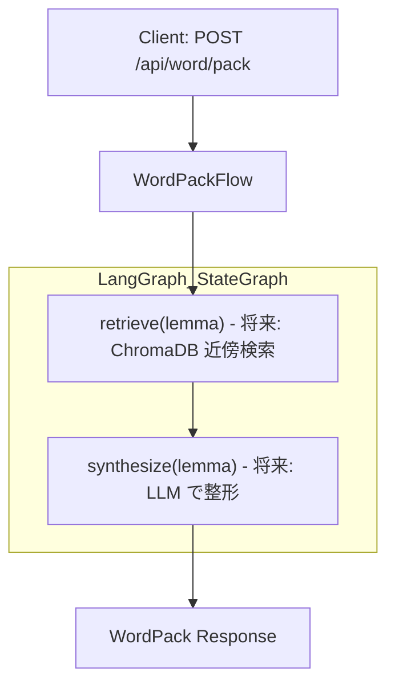
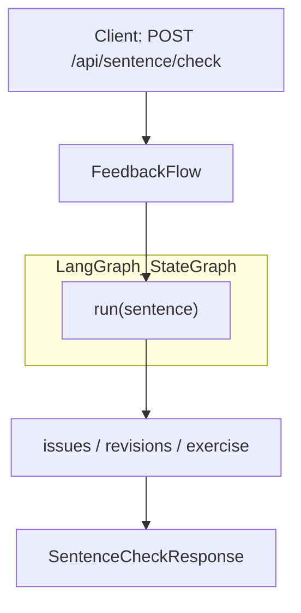

# WordPack for English

英単語トレーナー（OpenAI LLM×LangGraph）。技術・科学英文の読み・用法・発音の理解を支援します。リポジトリはバックエンド（FastAPI）とフロントエンド（React + Vite）のモノレポ構成です。

## 特徴
- バックエンド: FastAPI、構成・ルータ・簡易ログ、テストあり
- フロントエンド: React + TypeScript + Vite、単一ページ/6パネル構成（カード/自作文/段落注釈/WordPack/保存済み/設定）
- SRS（簡易SM-2, SQLite 永続化）: 今日のカード取得・3段階採点・進捗統計（今日の提案数/残数・最近5件）に対応（M6）
  - よく見る順（人気）APIを追加: `GET /api/review/popular?limit=10`（フロントのインデックスに反映）
- 発音強化（M5）: cmudict/g2p-en による IPA・音節・強勢推定（例外辞書・辞書キャッシュ・タイムアウト付きフォールバック）
- WordPack 再生成の粒度指定（M5）: 全体/例文のみ/コロケのみ の選択（Enum化済み）
- **WordPack永続化機能**: 生成されたWordPackを自動保存し、一覧表示・削除が可能（再生成は `WordPack` パネルから実行）
- **WordPackのみ作成（新）**: 内容生成を行わず、空のWordPackを保存できます（UI: 生成ボタン横）。
- **例文UIの改善（新）**: 英文・訳文・文法解説をカード型で横並びグリッド表示。各項目に「英/訳/解説」ラベルを付け、可読性を向上。
 - **名詞の用語解説を強化（新）**: 単語が名詞・専門用語の場合、各 `sense` に `term_core_ja`（本質・1〜2文）と `term_overview_ja`（概要・3〜5文）を追加出力・表示。用語としての概念や背景も学べます。

### フロントエンドのテーマ切替（ライト/ダーク）

- 既定は「ダークカラー」です。
- 「設定」タブの「カラーテーマ」から「ダークカラー」「ライトカラー」を切替できます。
- 選択はブラウザの `localStorage`（キー: `wp.theme`）に保存され、再訪時に復元されます。
- 実装詳細: `body` に `theme-dark`/`theme-light` を付与し、CSS 変数（例: `--color-bg`, `--color-text`, `--color-border`, `--color-link`, `--color-surface`）で配色を管理。

---

## 1. クイックスタート

### 1-1. 前提
- Python 3.11+ 推奨（requirementsは軽量）
- Node.js 18+ / pnpm or npm / (Vite)

### 1-2. 依存インストール
```bash
# Python
python -m venv .venv
. .venv/Scripts/activate  # Windows PowerShell: .venv\Scripts\Activate.ps1
pip install -r requirements.txt  # M5: 発音で cmudict / g2p-en を使用

# Frontend
cd src/frontend
npm install
```

### 1-3. OpenAI API キーの設定
```bash
# .env ファイルを作成し、OpenAI API キーを設定
cp env.example .env
# .env ファイルを編集して OPENAI_API_KEY を設定
```

注意: アプリ実行時は OpenAI API キーを設定してください（`.env`）。ただし、テスト/CI は LLM をモックして実行するためキーは不要です。

### 1-4. バックエンド起動
```bash
# リポジトリルートで
python -m uvicorn backend.main:app --reload --app-dir src
```
- 既定ポート: `http://127.0.0.1:8000`
- ヘルスチェック: `GET /healthz`
- ヘルスチェックは Docker Compose の `healthcheck` でも監視されます（PR4）。

### 1-5. フロントエンド起動
```bash
cd src/frontend
npm run dev
```
- 既定ポート: `http://127.0.0.1:5173`
- 開発時（別ポート）の呼び分け: Vite のプロキシ（既定）により接続設定は不要です。フロントからは相対パス `/api` で呼び出します。

### 1-6. Docker で一括起動（推奨・ホットリロード対応）
```bash
# リポジトリルートで
docker compose up --build
```
- バックエンド: http://127.0.0.1:8000
- フロントエンド: http://127.0.0.1:5173
- ホットリロード:
  - backend: `uvicorn --reload` + ボリュームマウント `.:/app`
  - frontend: Vite dev サーバ + ボリュームマウント `src/frontend:/app`
- フロントからの API 呼び出しは Vite のプロキシ設定で `http://backend:8000` に転送されます。

OpenAI LLM統合:
- 既定で `LLM_PROVIDER=openai` および `LLM_MODEL=gpt-4o-mini` を使用します。
- RAG機能は無効化されており、OpenAI LLMが直接語義・用例・フィードバックを生成します。
- 生成品質のため `LLM_MAX_TOKENS` を `.env` で調整できます（推奨 1500）。JSON 出力の途中切れを防止します。
 - フロントの設定タブに temperature 入力を追加しました（0.0〜1.0、デフォルト 0.6）。
   - 補足: 0.6–0.8（文体の多様性）、語数厳密なら 0.3–0.5
 - WordPack パネルの［生成］右にモデル選択（gpt-4.1-mini / gpt-5-mini / gpt-4o-mini）を追加。選択したモデルと temperature は生成/再生成のAPIに渡されます（未指定時はバックエンド既定）。
   - 注意: 現状バックエンドは Chat Completions を使用しており、gpt-5-mini の `reasoning`/`text` は未サポートです。選択しても内部で当該パラメータは無効化されます。安定運用は `gpt-4o-mini` を推奨。

### 1-7. ログとトラブルシューティング（語義/例文が「なし」になる場合）
- バックエンドは structlog による JSON 構造化ログを出力します（標準出力）。
- WordPack 生成パスの主なログイベント:
  - `wordpack_generate_request` … 入力診断（`lemma`, `pronunciation_enabled`, `regenerate_scope`）
  - `llm_provider_select` … LLM プロバイダ選択（`openai`/`local`）
  - `wordpack_llm_prompt_built` / `wordpack_llm_output_received` … LLM へのプロンプト構築と出力受領（文字数）
  - `wordpack_llm_json_parsed` … JSON 解析成功（`has_senses`, `has_examples`）
  - `wordpack_llm_json_parse_failed` / `wordpack_llm_examples_salvaged` … 解析失敗と例文のみサルベージ
  - `wordpack_senses_built` / `wordpack_examples_built` … 合成結果（件数）
  - `wordpack_generate_response` … 最終レスポンス診断（`senses_count`, `examples_total`, `has_definition_any`）

調査手順:
1. リクエスト直後の `wordpack_generate_request` を確認し、意図した `lemma` であるか確認
2. `llm_provider_select` が `openai` になっているか確認（`local` の場合、LLM出力は空になり得ます）
3. `wordpack_llm_output_received` の `output_chars` が十分か（0 または極端に小さい場合は `LLM_MAX_TOKENS` を増加）
4. `wordpack_llm_json_parsed` の `has_senses`/`has_examples` を確認。`false` の場合はプロンプト/モデル/トークン上限を調整
5. `wordpack_examples_built`/`wordpack_senses_built` の件数が 0 の場合、上流の LLM 出力の構造が仕様通りかチェック
6. それでも改善しない場合は `STRICT_MODE=true` で実行し、解析失敗時に例外化して根因を特定

厳格モードの空データ検出（エラー詳細）:
- `STRICT_MODE=true` のとき、語義(senses) と例文(examples) がともに空の場合は 502 を返します。
- レスポンス例:
  ```json
  {
    "detail": {
      "message": "WordPack generation returned empty content (no senses/examples)",
      "reason_code": "EMPTY_CONTENT",
      "diagnostics": { "lemma": "converge", "senses_count": 0, "examples_counts": { "Dev": 0, "CS": 0, "LLM": 0, "Business": 0, "Common": 0 } },
      "hint": "LLM_TIMEOUT_MS/LLM_MAX_TOKENS/モデル安定タグを調整してください。ログの wordpack_llm_* を確認。"
    }
  }
  ```
- 対応: `.env` の `LLM_TIMEOUT_MS` を増やす（例: 90000）、`LLM_MAX_TOKENS` を増やす（例: 1500–1800）、`LLM_MAX_RETRIES` を 2 へ、モデルを安定タグへ変更。

strict モードでのLLMエラー挙動:

- LLM がタイムアウト/失敗した場合、または空出力/パース不能で `senses`/`examples` が得られない場合はエラー（5xx）になります。
- 既定の LLM タイムアウトは 60 秒（`LLM_TIMEOUT_MS=60000`）。必要に応じて `.env` で調整してください。
- OpenAI SDK 呼び出しには `timeout` を適用し、内部ラッパでリトライ/キャンセル処理を行っています。

LLMエラーのHTTPマッピング（詳細化・新）:
- 504 Gateway Timeout（`reason_code=TIMEOUT`）
  - 意味: LLM応答が `LLM_TIMEOUT_MS` を超過。アプリのHTTP全体タイムアウトは `LLM_TIMEOUT_MS + 5秒`。
  - 対処: `LLM_TIMEOUT_MS` を増やす（例: 90000–120000）。必要なら `LLM_MAX_RETRIES` を 2 に。
- 429 Too Many Requests（`reason_code=RATE_LIMIT`）
  - 意味: LLMプロバイダのレート制限に到達。
  - 対処: しばらく待って再試行。アカウントのレート上限を確認。呼び出し頻度を下げる。
- 401 Unauthorized（`reason_code=AUTH`）
  - 意味: APIキー不備/権限不足。
  - 対処: `.env` の `OPENAI_API_KEY` を確認。コンテナ環境変数に反映されているか `docker compose exec backend env | grep OPENAI` 等で確認。

バックエンドログ（構造化）には次が追加され、原因切り分けが容易になりました（新）:
- `llm_complete_error` … `error_type` と `error`（例外メッセージの先頭）を出力
- `llm_complete_failed_all_retries` … 最終失敗時の `error_type`/`error`

推奨値の目安:
- `LLM_TIMEOUT_MS`: 90000–120000（語義/長文例文を安定取得）
- `LLM_MAX_TOKENS`: 1500–1800（JSON途切れ防止）
- `LLM_MAX_RETRIES`: 1–2（429対策）。過度な再試行は課金/レート圧迫に注意。

補足（reasoning/text パラメータ未対応時の挙動）:
- 一部のモデル/SDK 組み合わせでは、`reasoning` や `text` パラメータが未サポートで `TypeError: ... got an unexpected keyword argument 'reasoning'` が発生する場合があります。
- 本アプリは自動的に当該パラメータを外して再試行します。最終的に失敗する場合、strict モードでは `reason_code=PARAM_UNSUPPORTED` として分類してエラー化します。
- 対応策: モデルを `gpt-4o-mini` 等に切り替えるか、OpenAI SDK を更新してください（`pip install -U openai`）。

Tips (Windows)：Vite のファイル監視が不安定な場合、`CHOKIDAR_USEPOLLING=1` を環境変数に設定してください（compose の service へ追加可能）。

---

## 2. ディレクトリ構成（抜粋）
```
app/                     # 追加のサンプルFastAPIアプリ（静的配信デモ等）
src/backend/             # 本番用FastAPIアプリ
  main.py                # ルータ登録/ログ初期化
  config.py              # 環境設定（pydantic-settings）
  logging.py             # structlog設定
  routers/               # エンドポイント群
  flows/                 # LangGraphベースの処理
  models/                # pydanticモデル（厳密化済み: Enum/Field制約/例）
  pronunciation.py       # 発音（cmudict/g2p-en優先・例外辞書/キャッシュ/タイムアウト付き）
src/frontend/            # React + Vite
  src/components/        # 4パネルのコンポーネント
  src/SettingsContext.tsx
static/                  # 最小UIの静的ファイル（`app/main.py`用）
```

---

## 3. API 概要
FastAPI アプリは `src/backend/main.py`。

- `GET /healthz`
  - ヘルスチェック。レスポンス: `{ "status": "ok" }`

- `GET /metrics`
  - 運用メトリクスのスナップショット。パス別に `p95_ms`, `count`, `errors`, `timeouts` を返す（M6）。
  - 併せてアクセスログは JSON 構造化で出力され、`request_complete` に以下フィールドを含みます（PR4）:
    - `request_id`, `path`, `method`, `latency_ms`, `is_error`, `is_timeout`, `client_ip`, `user_agent`

- `POST /api/word/pack`
  
- `POST /api/word/packs`（新）
  - 内容生成を行わず、空のWordPackを作成してIDを返します。
  - リクエスト例: `{ "lemma": "insight" }`
  - レスポンス例: `{ "id": "wp:insight:a1b2c3d4" }`
  - 周辺知識パック生成（OpenAI LLM: 語義/共起/対比/例文/語源/学習カード要点/発音RPを直接生成し `citations` と `confidence` を付与）。
  - 発音: 実装は `src/backend/pronunciation.py` に一本化。cmudict/g2p-en を優先し、例外辞書・辞書キャッシュ・タイムアウトを備えた規則フォールバックで `pronunciation.ipa_GA`、`syllables`、`stress_index` を付与。
  - 例文: Dev/CS/LLM/Business/Common 別の英日ペア配列で返却。各要素は `{ en, ja, grammar_ja?, category?, llm_model?, llm_params? }`。カテゴリ定義は次の通り：
    - `category` はサーバが付与するカテゴリEnum（`Dev|CS|LLM|Business|Common`）。後方互換のため任意。
    - `llm_model` は例文生成に使用したモデル名（任意）。
    - `llm_params` は当該リクエスト時の主要パラメータを連結した文字列（例: `"temperature=0.60;reasoning.effort=minimal;text.verbosity=medium"`）（任意）。
    - 既存クライアントは `en/ja/grammar_ja` のみを参照しており、UI変更は不要です。
    - Dev … ITエンジニアの開発現場（アプリ開発）の文脈
    - CS … 計算機科学の学術研究の文脈
    - LLM … LLMの応用/研究の文脈
    - Business … ビジネスの文脈
    - Common … 日常会話のカジュアルなやり取り（友人・同僚との雑談/チャット等）。ビジネス文書調の語彙（therefore, regarding, via など）は避け、軽いノリの口語（過度なスラングは不可）で、メッセや通話、待ち合わせなど身近な場面を想定。
  - 語義の拡張（本リリース）: 各 `sense` に以下の詳細フィールドを追加し、よりボリューミーに表示します。
    - `definition_ja: string?` … 日本語の定義（1–2文）
    - `nuances_ja: string?` … 使い分け/含意/文体レベル
    - `patterns: string[]` … 典型パターン
    - `synonyms: string[]` / `antonyms: string[]`
    - `register: string?` … フォーマル/口語など
    - `notes_ja: string?` … 可算/不可算や自他/前置詞選択などの注意
    - 名詞/専門用語のとき: `term_core_ja: string?`（用語の本質） / `term_overview_ja: string?`（用語の概要）。動詞・形容詞などの場合は省略可。
    - 件数: `Dev/CS/LLM` は各5文、`Business` は3文、`Common` は6文（不足時は短くなる／空許容、ダミーは入れない）。`Common` は日常会話のカジュアルな用例に限定し、フォーマル表現は避ける。
    - 長さ: 英文は原則 約75語（±5語）を目安。
    - 解説: `grammar_ja` に文法的な要点を日本語で付与（任意）。
  - リクエスト例（M5 追加パラメータ・Enum化）:
    ```json
    { "lemma": "converge", "pronunciation_enabled": true, "regenerate_scope": "all" }
    ```
    - `pronunciation_enabled`: 発音情報の生成 ON/OFF（既定 true）
    - `regenerate_scope`: `all` | `examples` | `collocations`（Enum）。
  - レスポンス例（抜粋）:
    ```json
    {
      "lemma": "converge",
      "pronunciation": {"ipa_GA":"/kənvɝdʒ/","ipa_RP":"/kənˈvɜːdʒ/","syllables":2,"stress_index":1,"linking_notes":[]},
      "senses": [{"id":"s1","gloss_ja":"集まる・収束する","patterns":["converge on N"]}],
  - 追加の `senses` 詳細の例:
    ```json
    {
      "id": "s1",
      "gloss_ja": "集まる・収束する",
      "definition_ja": "複数のものが一点・一方向に向かって近づき一つにまとまること。",
      "nuances_ja": "学術文脈では系列や推定量が極限へ近づく含意が強い。",
      "patterns": ["converge on N", "converge toward N"],
      "synonyms": ["gather", "meet"],
      "antonyms": ["diverge"],
      "register": "formal",
      "notes_ja": "自動詞。数学/統計では to/toward の選択でニュアンス差あり。"
    }
    ```
      "collocations": {"general": {"verb_object": ["gain insight"], "adj_noun": ["deep insight"], "prep_noun": ["insight into N"]}, "academic": {"verb_object": ["derive insight"], "adj_noun": ["empirical insight"], "prep_noun": ["insight for N"]}},
      "contrast": [{"with":"intuition","diff_ja":"直観は体系的根拠が薄いのに対し、insight は分析や経験から得る洞察。"}],
      "examples": {
        "Dev": [
          {"en":"We gained insight after refactoring modules and reviewing logs.","ja":"モジュールのリファクタリングとログ確認の後に洞察を得た。","grammar_ja":"第3文型"}
        ],
        "CS": [
          {"en":"Under mild assumptions, an estimator gains insight about latent structure.","ja":"温和な仮定の下で推定量は潜在構造について洞察を得る。","grammar_ja":"不定詞"}
        ],
        "LLM": [
          {"en":"With better prompts, outputs converge and provide clearer insight.","ja":"プロンプト改善により出力が収束し明確な洞察が得られる。","grammar_ja":"分詞構文"}
        ],
        "Business": [
          {"en":"Metrics offer insight as systems stabilize across deployments.","ja":"デプロイを重ねるにつれメトリクスが洞察を与える。","grammar_ja":"現在形"}
        ],
        "Common": [
          {"en":"Over months, we gained insight and made a better decision.","ja":"数か月を経て洞察を得て、より良い判断を下した。","grammar_ja":"過去形"}
        ]
      },
      "etymology": {"note":"from Middle English, influenced by Old Norse.","confidence":"medium"},
      "study_card": "insight: into による対象提示。deep/valuable と相性良。",
      "citations": [{"text":"LLM-generated information for insight","meta":{"source":"openai_llm","word":"insight"}}],
      "confidence": "high"
    }
    ```

  

- `POST /api/sentence/check`
  - 自作文チェック（OpenAI LLM による詳細な文法・スタイル分析と `confidence` を付与）。
  - LLM が有効な場合、issues/revisions/mini exercise を安全に補強します（失敗時はフォールバック）。
  - レスポンス例（抜粋）:
    ```json
    { "issues": [{"what":"語法","why":"対象語の使い分け不正確","fix":"共起に合わせて置換"}],
      "revisions": [{"style":"natural","text":"..."}],
      "exercise": {"q":"Fill the blank: ...","a":"..."} }
    ```

- `POST /api/text/assist`
  - 段落注釈（OpenAI LLM: 文の解析・パラフレーズ・語彙情報を直接生成し `citations` と `confidence` を付与）。
  - LLM が有効なら各文の簡易パラフレーズを生成し、総合 `confidence` を調整します。
  - レスポンス例（抜粋）:
    ```json
    { "sentences": [{"raw":"Some text","terms":[{"lemma":"Some"}]}], "summary": null, "citations": [] }
    ```

- `GET /api/review/today`
  - 本日の復習カード（最大5枚）を返します。
  - レスポンス例:
    ```json
    { "items": [ { "id": "w:converge", "front": "converge", "back": "to come together" } ] }
    ```

- `POST /api/review/grade`
  - 復習カードの採点を記録。簡易SM-2で次回出題時刻を更新。
  - リクエスト例: `{ "item_id": "w:converge", "grade": 2 }`（2=正解,1=部分的,0=不正解）
  - レスポンス例: `{ "ok": true, "next_due": "2025-01-01T12:34:56.000Z" }`
  - 実装: `src/backend/srs.py`（SQLite 永続化）。復習履歴は `reviews` テーブルに保存され、同時実行はトランザクションで保護されます。

- `POST /api/review/grade_by_lemma`
  - レンマ（例: `"converge"`）を指定して採点。カード未存在時は自動作成。
  - 自動作成の仕様: `id = "w:<lemma>"`, `front = lemma`, `back = WordPack.study_card`。
  - リクエスト例: `{ "lemma": "converge", "grade": 0 }`（0|1|2）
  - レスポンス例: `{ "ok": true, "next_due": "2025-01-01T12:34:56.000Z" }`
  - OpenAPI補足（スキーマ）:
    - Request: `ReviewGradeByLemmaRequest` … `lemma: str (1..64)`, `grade: int (0..2)`
    - Response: `ReviewGradeResponse` … `ok: bool`, `next_due: datetime`

- `GET /api/review/stats`
  - 進捗統計（セッション体験用）
  - レスポンス例:
    ```json
    { "due_now": 3, "reviewed_today": 7, "recent": [ {"id":"w:converge","front":"converge","back":"to come together"} ] }
    ```

- `GET /api/review/popular`
  - よく見る順（レビュー回数の多い順）で最大 `limit` 件のカードを返します（既定 10）。
  - レスポンス例:
    ```json
    [ { "id": "w:converge", "front": "converge", "back": "to come together" } ]
    ```

- `GET /api/review/card_by_lemma`
  - レンマからカードの SRS メタ（登録済みなら）を返します。未登録なら 404。
  - クエリ: `?lemma=<string>`（例: `?lemma=converge`）
  - レスポンス例:
    ```json
    { "repetitions": 3, "interval_days": 6, "due_at": "2025-01-01T12:34:56.000Z" }
    ```

### WordPack永続化API

- `GET /api/word/packs`
  - 保存済みWordPackの一覧を取得。ページネーション対応。
  - クエリ: `?limit=<int>&offset=<int>`（例: `?limit=20&offset=0`）
  - レスポンス例:
    ```json
    {
      "items": [
        {
          "id": "wp:converge:a1b2c3d4",
          "lemma": "converge",
          "created_at": "2025-01-01T12:34:56.000Z",
          "updated_at": "2025-01-01T12:34:56.000Z",
          "is_empty": true
        }
      ],
      "total": 1,
      "limit": 20,
      "offset": 0
    }
    ```

- `GET /api/word/packs/{word_pack_id}`
  - 指定されたIDのWordPackを取得。
  - レスポンス: 完全なWordPackオブジェクト（`POST /api/word/pack`と同じ形式）
  - 存在しない場合は404エラー

- `POST /api/word/packs/{word_pack_id}/regenerate`
  - 既存のWordPackを再生成。指定されたIDのWordPackを上書き更新。
  - リクエスト例: `{ "pronunciation_enabled": true, "regenerate_scope": "all" }`
  - レスポンス: 再生成されたWordPackオブジェクト

- `DELETE /api/word/packs/{word_pack_id}`
  - 指定されたIDのWordPackを削除。
  - レスポンス例: `{ "message": "WordPack deleted successfully" }`
  - 存在しない場合は404エラー

### 3-1. 引用と確度（citations/confidence）の読み方（PR5）
- citations（引用）:
  - **意味**: OpenAI LLM が生成した情報の参照元。
  - **使い方**: 生成内容の根拠をたどる用途。LLM生成の情報は `{"source": "openai_llm"}` として記録されます。
- confidence（確度）:
  - **値**: `low | medium | high`（Enum）
  - **方針**: LLM の生成品質や整合性ヒューリスティクスに基づき調整。UI ではバッジで表示します。
  - **読み方**: `high` はLLM生成が成功し詳細な情報が得られた状態、`low` はフォールバック情報のみの状態を示します。

補足:
- ルータのプレフィックスは `src/backend/main.py` で設定されています。
`flows/*` は LangGraph による処理で、RAG（Chroma）と `citations`/`confidence` の一貫管理を導入済みです。`ReadingAssistFlow` は簡易要約を返し、`FeedbackFlow` はRAG引用を付与します。各ルータにはタグ/summaryが付与され、OpenAPI の可読性を向上しています。

---

## 4. フロントエンド UI 概要
単一ページで以下の6タブを切替。初期表示は「保存済み」タブ。最小スタイル・セマンティックHTMLを志向。

- カード（`CardPanel.tsx`）
  - `カードを取得` で本日の一枚を取得し、`復習` で採点
  - 使用API: `GET {apiBase}/review/today`, `POST {apiBase}/review/grade`

- 自作文（`SentencePanel.tsx`）
  - 文入力→`チェック`。使用API: `POST {apiBase}/sentence/check`
  - 返却された `issues/revisions/exercise` を画面に表示

- 段落注釈（`AssistPanel.tsx`）
  - 段落入力→`アシスト`。使用API: `POST /api/text/assist`
  - 返却された `sentences/summary` を画面に表示

- WordPack（`WordPackPanel.tsx`）
  - 見出し語を入力→`生成`。使用API: `POST /api/word/pack`
  - 1画面で「発音/語義/語源/例文/共起/対比/インデックス/引用/信頼度/学習カード要点」を表示（「語源」は「語義」の直後、「共起」「対比」「インデックス」は「例文」の直後に表示）。
  - 例文はカード型（英/訳/解説ラベル付き）で、レベルごとに1列で縦に積んで表示します（横並びにしません）。
  - セルフチェック: 初期は学習カード要点に3秒のぼかしが入り、クリックで即解除可能。
  - SRS連携: 画面上で ×/△/○ の3段階採点が可能。`POST /api/review/grade_by_lemma` を呼び出し、未登録なら自動でカードを作成。
  - SRSメタ: `GET /api/review/card_by_lemma` で登録状況と `repetitions/interval_days/due_at` を表示（未登録時は「未登録」）。採点後は進捗/インデックス（最近/よく見る）と併せて自動更新。
  - ショートカット: `1/J = ×`, `2/K = △`, `3/L = ○`。設定で「採点後に自動で次へ」を切替可能。
  - 進捗の見える化（PR4）: 画面上部に「今日のレビュー済/残り」「最近見た語（直近5）」、セッション完了時の簡易サマリ（件数/所要時間）を表示。
  - 単語アクセス導線（PR5）: 「対比」や「共起」から横展開リンクで他語へ移動。「例文」の直後に「インデックス（最近/よく見る）」を表示。
  - **永続化機能**: 生成されたWordPackは自動的にデータベースに保存され、再生成ボタンで内容を更新可能。

- 保存済み（`WordPackListPanel.tsx`）
  - 保存済みWordPackの一覧をカード形式で表示。使用API: `GET /api/word/packs`
  - 各カードはクリックでモーダルが開き、内容をプレビューできます（Esc または「閉じる」で閉じる）。
  - カード内の「削除」ボタンでWordPackを削除できます。
  - ページネーション機能（limit/offset）で大量のWordPackを効率的に閲覧。
  - 作成日時・更新日時を表示し、管理しやすいUIを提供。

- 設定（`SettingsPanel.tsx`）
  - 発音の有効/無効トグル（M5）
  - 再生成スコープ選択（`全体/例文のみ/コロケのみ`）（M5, Enum）
  - 採点後に自動で次へ（WordPack採点時にリセット）

アクセシビリティ/操作:
- Alt+1..6 でタブ切替、`/` で主要入力へフォーカス
- WordPack表示中: `1/J`, `2/K`, `3/L` で採点
- ローディング中は `role="status"`、エラーは `role="alert"`
  - 読み込み表示は `LoadingIndicator` コンポーネントに統一。スピナー＋経過時間（mm:ss）と詳細サブテキストを表示します。
    - 生成時: 「生成処理を実行中 / LLM応答の受信と解析を待機しています…」
    - 再生成時: 「再生成を実行中 / 指定スコープでLLMにより内容を再構築しています…」
    - 保存済み読み込み時: 「保存済みWordPackを読み込み中 / サーバーから詳細を取得しています…」
    - 採点処理時: 「採点を記録中 / SRSメタ・進捗を更新しています…」

---

## 5. テスト
`pytest` による統合/E2E/負荷・回帰テストを含みます。
```bash
pytest
# もしくは従来同様の明示オプション
pytest -q --cov=src/backend --cov-report=term-missing --cov-fail-under=60
```
- カバレッジ閾値は `pytest.ini` に設定（60%）。必要に応じて上書き可。
- テスト構成:
  - `tests/test_api.py` … API基本動作（LangGraph/Chroma はスタブ）
  - `tests/test_integration_rag.py` … LangGraph/Chroma 統合（最小シードで近傍と `citations`/`confidence` を検証）
  - `tests/test_e2e_backend_frontend.py` … フロント→バックE2E相当のAPIフロー（正常/異常系の健全性）
  - `tests/test_load_and_regression.py` … 軽負荷スモークとスキーマ回帰チェック
    - PR4 追加: RAG 有効/無効の双方で基本SLA（少数リクエストで5秒以内）を検証。`X-Request-ID` ヘッダの付与も確認。

注意:
- 統合テストはローカルの Chroma クライアント（`chromadb`）を利用し、フィクスチャでテスト専用ディレクトリに最小シードを投入します（環境変数 `CHROMA_PERSIST_DIR` を内部使用）。
- RAG は `settings.rag_enabled` に従います。既定 `True`。
- LLM プロバイダはアプリ内でシングルトンとしてキャッシュされ、タイムアウト/リトライの実行には共有スレッドプールを使用します。FastAPI のシャットダウンイベントで安全に解放されます。

---

## 6. 設定/環境変数
- `src/backend/config.py`
  - 共通:
    - `environment`
    - `llm_provider` … `openai` | `local`
    - `llm_model` … 既定 `gpt-5-mini`（OpenAIを使う場合は実在モデルに置換推奨: 例 `gpt-4o-mini`）
    - `llm_timeout_ms` / `llm_max_retries`
    - `embedding_provider` … 既定 `openai`
    - `embedding_model` … 既定 `text-embedding-3-small`
  - RAG/Chroma:
    - `rag_enabled`, `rag_timeout_ms`, `rag_max_retries`, `rag_rate_limit_per_min`
    - `chroma_persist_dir`, `chroma_server_url`
  - APIキー:
    - `openai_api_key`
    - `voyage_api_key`（将来）
  - SRS（SQLite）
    - `srs_db_path`, `srs_max_today`
  - `.env` を読み込みます。サンプル: `env.example`
  - 運用/監視（PR4）
    - `rate_limit_per_min_ip`, `rate_limit_per_min_user` … API レート制限（IP/ユーザ毎・毎分）
    - `sentry_dsn` … Sentry DSN（設定すると例外を自動送信）

### 6-1. env.example（サンプル）
`env.example` を参考に `.env` を作成してください。特に以下の新設定があります。

- `LLM_PROVIDER`（既定: `openai`）
  - OpenAI LLMを使用する場合は `openai` を設定。
  - テスト/オフライン開発では `local` に設定することで、ローカルフォールバック動作を許容します。
- `OPENAI_API_KEY`
  - OpenAI API キーを設定してください。設定されていない場合は安全なフォールバックモードで動作します。
- `STRICT_MODE`（既定: `true`）
  - 本番/実運用では `true` を推奨。必須設定が不足している場合はフォールバックせずエラーにします（Fail-Fast）。
  - テスト/オフライン開発では `false` に設定することで、ローカル/ダミー挙動を許容します。
 - `LLM_MAX_TOKENS`（既定: `900`）
   - WordPack のJSONが途中で切れないよう、十分なトークン数を確保してください。

補足（互換キーの無視）:
- 旧サンプル/別アプリ由来のキー（例: `API_KEY`/`ALLOWED_ORIGINS` など）が `.env` に残っていても、`src/backend/config.py` は未使用の環境変数を無視する設定になっています（`extra="ignore"`）。
- そのため Docker 環境でも、未使用キーが存在して起動が失敗することはありません。

### 6-2. SRS データ移行の注意点（PR5）
- 既定のDBパス: `SRS_DB_PATH=.data/srs.sqlite3`
- 権限: 実行ユーザに `.data/` ディレクトリの作成/書込権限が必要です。
- バックアップ: 重要データのため変更前にバックアップを取得してください。
  - 例（Windows PowerShell）: `Copy-Item .data/srs.sqlite3 .data/srs.backup.sqlite3`
- パス変更: `.env` の `SRS_DB_PATH` を新パスに設定し、アプリを再起動します。
- スキーマ変更（将来）: 互換が壊れる場合はマイグレーション手順をREADMEに追記します。暫定実装では互換維持・自動作成（存在しない場合）です。

補足（PR4: レート制限/ログ/SLA）:
- API リクエストには自動で `X-Request-ID` が割り当てられ、レスポンスヘッダにも付与されます。
- レート制限は簡易トークンバケットで、IP と `X-User-Id`（任意ヘッダ）単位に毎分の上限を適用します。超過時は `429 Too Many Requests` を返します。
- Sentry DSN を設定すると、ERROR 以上のログ/例外が送信されます（依存: `sentry-sdk`）。

---

## 7. 開発メモ（現状とTODO）
- フロントエンドAPIパスの整合: Sentence/Assist は `/api/*` に統一済み
- LangGraph フロー実装
  - `flows/word_pack.py`, `flows/reading_assist.py`, `flows/feedback.py`
- OpenAI LLM統合（RAG無効化）
  - 各フローでOpenAI LLMを直接使用して語義・用例・フィードバックを生成
  - `backend/providers.py` に OpenAI LLM クライアントを実装
  - RAG機能は無効化され、ChromaDB依存を削除
- SRS/発音
  - SRS: `src/backend/srs.py` に簡易SM-2のインメモリ実装を追加（`/api/review/*` が利用）
  - 発音: `src/backend/pronunciation.py` に実装（cmudict/g2p-en 優先、例外辞書/辞書キャッシュ/タイムアウト付きフォールバック）。`WordPackRequest.pronunciation_enabled` で生成の ON/OFF が可能。
- CORS/タイムアウト/メトリクス（M6）
  - `src/backend/main.py` に CORS/Timeout/アクセスログ（JSON, structlog）とメトリクス記録を実装
  - `/metrics` で p95/件数/エラー/タイムアウトのスナップショットを返却
  - HTTP レベルの全体タイムアウトは `LLM_TIMEOUT_MS` に +5秒した値を Starlette `TimeoutMiddleware` に適用します（環境変数で調整）。
  - Chroma 近傍クエリは2回まで軽量リトライ

### LangGraph 互換性メモ（重要）
- `flows/*` は LangGraph の `StateGraph` を内部的に利用します。
- バージョンにより `StateGraph()` の引数仕様が異なるため、共通ヘルパ `backend.flows.create_state_graph()` で生成しています。
  - 旧API: 引数なしで生成
  - 新API: `state_schema` を要求 → 最小 `TypedDict` を自動指定
- これにより、LangGraph の軽微な API 変更でも 500 を避けられます。
- もし `POST /api/review/grade` などで 500 が出た場合は、コンテナログに `StateGraph.__init__() missing 1 required positional argument: 'state_schema'` がないか確認してください。最新版では修正済みです。

### 更新履歴（短報）
- 2025-09-08: WordPack 生成時の NameError（`CollocationLists` 未定義）を修正。`src/backend/flows/word_pack.py` に `CollocationLists`/`ContrastItem` をインポート追加。Docker/ローカルとも再起動・再ビルドで解消。
- 2025-09-08: `ContrastItem` の Pydantic v2 エイリアス設定を修正（`model_config = ConfigDict(populate_by_name=True)`）。`contrast` の各要素は API では `{"with": string, "diff_ja": string}` として返り、内部モデルでは `with_` フィールドで受け付けます。

---

## 8. ライセンス
なし。

---

## 9. 付録: LangGraph ベースのAI処理フロー（Mermaid）

### 9-1. WordPackFlow（語彙パック生成）


### 9-2. ReadingAssistFlow（リーディング支援）


### 9-3. FeedbackFlow（自作文フィードバック）


## 10. 付録: OpenAIモデルの比較情報（本プロジェクトは Responses API に移行済み）

注意: 本プロジェクトのバックエンドは **Responses API を使用**します。これにより、推論系の `reasoning`/`text` パラメータを適切に指定できます（未対応エラー時は自動でパラメータを外して再試行）。

このプロジェクトで制御できるパラメータ（Responses API）:
- **gpt-4o-mini / gpt-4.1-mini**: `temperature`, `max_output_tokens`（= `.env: LLM_MAX_TOKENS`）
- **gpt-5-mini**: `reasoning.effort`, `text.verbosity`, `max_output_tokens`（`temperature` は通常無効）

結論：**gpt-5-mini は推論系（reasoning）モデル**で、**Responses API で `reasoning`/`text` を利用**します。**gpt-4.1-mini** と **gpt-4o-mini** は従来どおり **`temperature`** が有効です（UIでは `temperature`/推論系では `reasoning.effort` を選択）。

UI補足：フロントで `gpt-5-mini` を選択した場合は `reasoning.effort`/`text.verbosity` がバックエンドに渡され有効化されます。非推論系では `temperature` が有効です。

---

## gpt-5-mini（reasoning系：`temperature`は使わない／本プロジェクトでは実質非対応）

Responses API（本プロジェクトで有効）:
```json
{
  "model": "gpt-5-mini",
  "max_output_tokens": 1600
}
```
- **有効**: `max_output_tokens`, `reasoning`, `text`
- **無効**: `temperature`（多くの推論系モデル）

Chat Completions（参考: 本プロジェクトでは未使用）:
```json
{
  "model": "gpt-5-mini",
  "max_tokens": 1600
}
```

## gpt-4.1-mini（従来型テキスト：sampling系が有効）

```json
{
  "model": "gpt-4.1-mini",
  "temperature": 0.45,
  "max_tokens": 1600
}
```
- **有効**: `temperature`, `max_tokens`

## gpt-4o-mini（高コスパ量産：sampling系が有効）

```json
{
  "model": "gpt-4o-mini",
  "temperature": 0.60,
  "max_tokens": 1600
}
```
- **有効**: `temperature`, `max_tokens`

---

## 80語×10文タスク向けの微調整ヒント

* **語数の安定化**：Responses API の **Structured Outputs** や JSON スキーマで「`minItems=10`/`maxItems=10`」「各文 `word_count` は 70–90」などを強制すると取り回しが楽です（どのモデルでも可）。([OpenAI Cookbook][3])
* **gpt-5-mini を使うとき**は `temperature` ではなく `reasoning.effort` を段階的に上げ下げして文のまとまり・一貫性を調整します（例：`minimal`→高速量産、`low/medium`→表現の精緻化）。([OpenAI Cookbook][4])

---

## 参考：なぜ `temperature` が「廃止扱い」なのか

* \*\*推論系モデル（o3/o4-mini/GPT-5系）\*\*では内部で思考トークンを別勘定し、その振る舞いを **`reasoning.effort`** 等で制御する設計に移行。**この系統では `temperature` などのサンプリング系パラメータは未サポート**と公式に明記されています。([Microsoft Learn][1])
* 逆に **非推論モデル（GPT-4.1系・4o系）**では、**`temperature`/`top_p`** が引き続きサポートされ、OpenAIの API リファレンスでも調整指針（どちらか片方を調整）が示されています。([OpenAI Platform][2])

[1]: https://learn.microsoft.com/en-us/azure/ai-foundry/openai/how-to/reasoning "Azure OpenAI reasoning models - GPT-5 series, o3-mini, o1, o1-mini - Azure OpenAI | Microsoft Learn"
[2]: https://platform.openai.com/docs/api-reference/responses-streaming/response/function_call_arguments?utm_source=chatgpt.com "API Reference"
[3]: https://cookbook.openai.com/examples/gpt4-1_prompting_guide "GPT-4.1 Prompting Guide"
[4]: https://cookbook.openai.com/examples/gpt-5/gpt-5_new_params_and_tools?utm_source=chatgpt.com "GPT-5 New Params and Tools"
