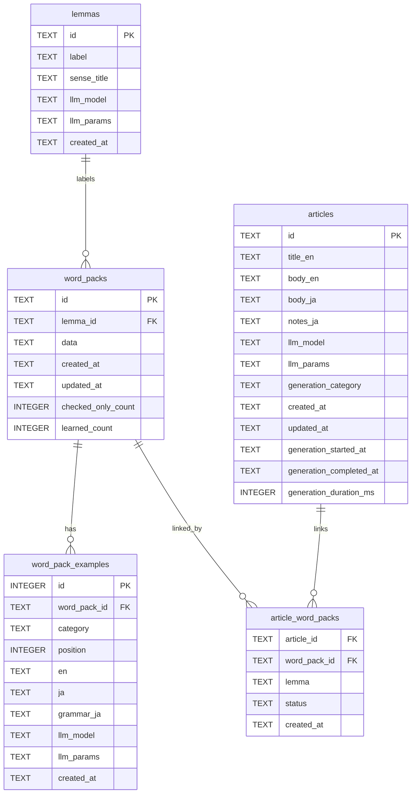

### DB ER 図（Mermaid）

以下は Firestore 移行前の SQLite 実装に基づく主要テーブルとリレーションのER図です。現行の Firestore コレクション設計を把握するための参考資料として残しています。

補足:
- `word_pack_examples.word_pack_id` は `word_packs.id` を参照（ON DELETE CASCADE）。
- `word_packs.lemma_id` は `lemmas.id` を参照（ON DELETE CASCADE）。
- `article_word_packs.article_id` は `articles.id` を参照（ON DELETE CASCADE）。
- `article_word_packs.word_pack_id` は `word_packs.id` を参照（ON DELETE CASCADE）。
- `article_word_packs` の主キーは `(article_id, word_pack_id)` の複合主キー。
- インデックス（実装由来）
  - `idx_lemmas_label_ci(lower(label))`
  - `idx_word_packs_lemma_id(lemma_id)`, `idx_word_packs_created_at(created_at)`
  - `idx_wpex_pack(word_pack_id)`, `idx_wpex_pack_cat_pos(word_pack_id, category, position)`
  - `idx_articles_created_at(created_at)`, `idx_articles_title(title_en)`
  - `idx_article_wps_article(article_id)`, `idx_article_wps_lemma(lemma)`

データ由来の値の例:
- `word_pack_examples.category`: {"Dev","CS","LLM","Business","Common"}
- `article_word_packs.status`: {"existing","created"}

