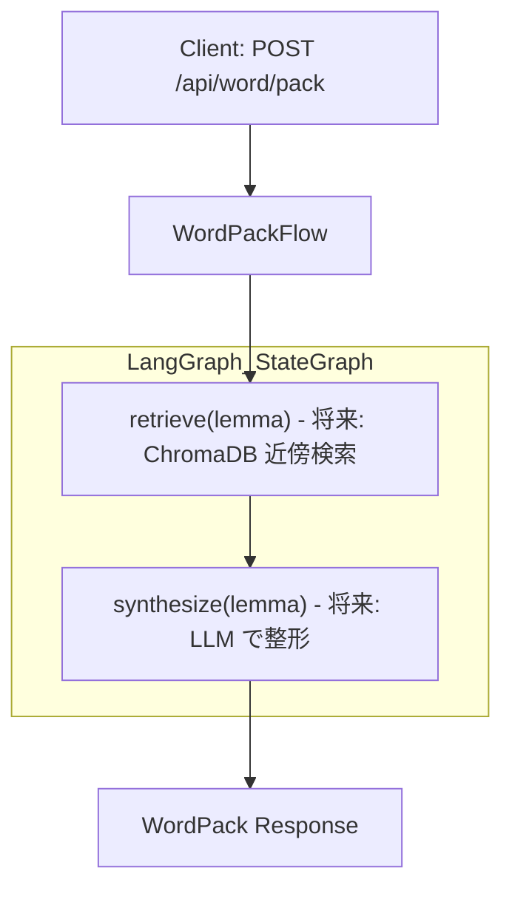
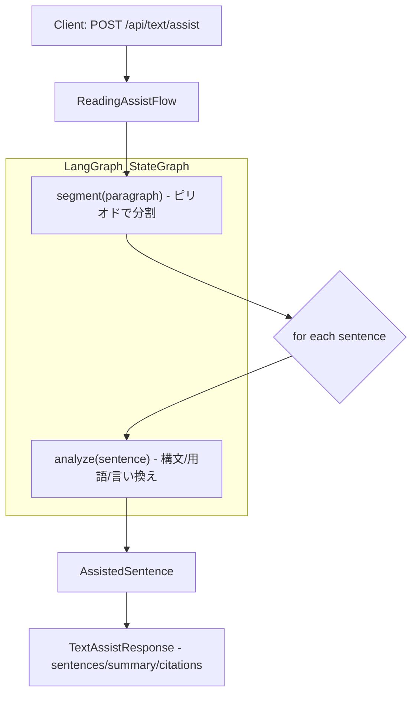
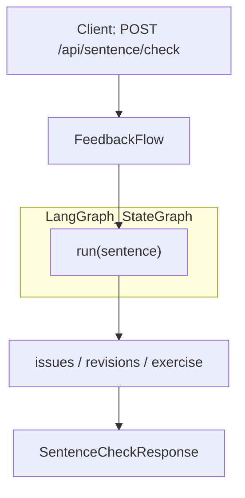

# 付録: LangGraph ベースのAI処理フロー

## WordPackFlow（語彙パック生成）

```mermaid
graph TD
    A[Client: POST /api/word/pack] --> B[WordPackFlow];
    B --> C["retrieve(lemma) - 将来: ChromaDB 近傍検索"];
    C --> D["synthesize(lemma) - 将来: LLM で整形"];
    D --> E[WordPack Response];

    subgraph LangGraph_StateGraph
        C
        D
    end
```

## ReadingAssistFlow（リーディング支援）

```mermaid
graph TD
    A[Client: POST /api/text/assist] --> B[ReadingAssistFlow];
    B --> C["segment(paragraph) - ピリオドで分割"];
    C --> D{for each sentence};
    D --> E["analyze(sentence) - 構文/用語/言い換え"];
    E --> F[AssistedSentence];
    F --> G["TextAssistResponse - sentences/summary/citations"];

    subgraph LangGraph_StateGraph
        C
        E
    end
```

## FeedbackFlow（自作文フィードバック）

```mermaid
graph TD
    A[Client: POST /api/sentence/check] --> B[FeedbackFlow];
    B --> C["run(sentence)"];
    C --> D["issues / revisions / exercise"];
    D --> E[SentenceCheckResponse];

    subgraph LangGraph_StateGraph
        C
    end
```
