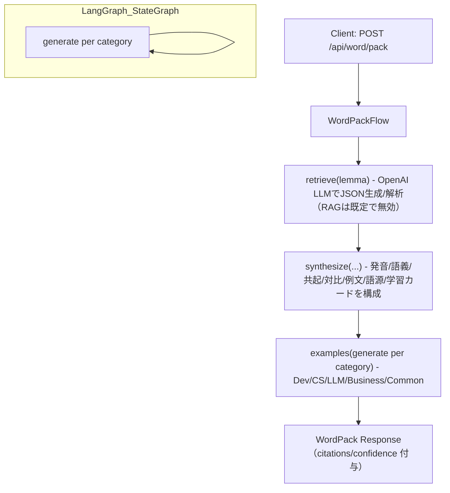
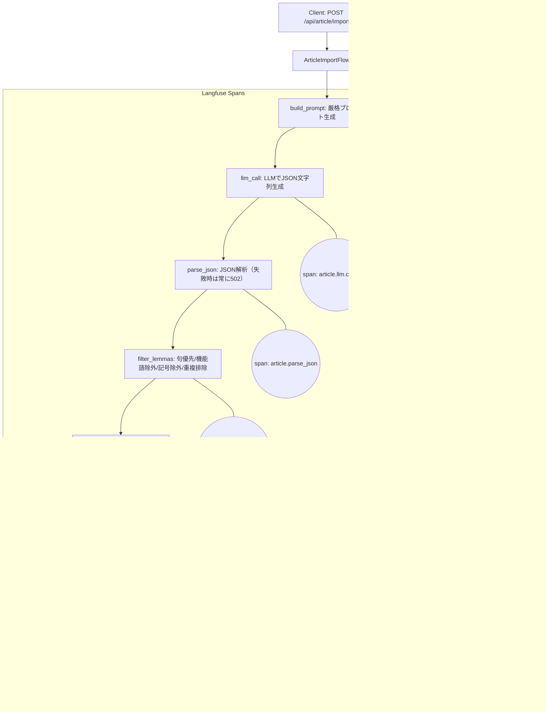

# 付録: LangGraph ベースのAI処理フロー

## WordPackFlow（語彙パック生成）

```mermaid
graph TD
    A[Client: POST /api/word/pack] --> B[WordPackFlow];
    B --> C["retrieve(lemma) - OpenAI LLMでJSON生成/解析（RAGは既定で無効）"];
    C --> D["synthesize(...) - 発音/語義/共起/対比/例文/語源/学習カードを構成"];
    D --> E["examples(generate per category) - Dev/CS/LLM/Business/Common"];
    E --> F["WordPack Response（citations/confidence 付与）"];

    subgraph LangGraph_StateGraph
        G[generate per category]
        G --> G
    end
```

## ArticleImportFlow（文章インポート）

```mermaid
graph TD
    A[Client: POST /api/article/import] --> B[ArticleImportFlow];
    B --> C[build_prompt: 厳格プロンプト生成];
    C --> D[llm_call: LLMでJSON文字列生成];
    D --> E[parse_json: JSON解析（失敗時は常に502）];
    E --> F[filter_lemmas: 句優先/機能語除外/記号除外/重複排除];
    F --> G[link_or_create: 既存WordPack紐付け/なければ空パック作成];
    G --> H[save_article: 記事保存・メタ取得];
    H --> I[ArticleDetailResponse];

    subgraph Langfuse Spans
        C --- C1((span: article.build_prompt))
        D --- D1((span: article.llm.complete))
        E --- E1((span: article.parse_json))
        F --- F1((span: article.filter_lemmas))
        G --- G1((span: article.link_or_create_wordpacks))
        H --- H1((span: article.save_article))
    end
```