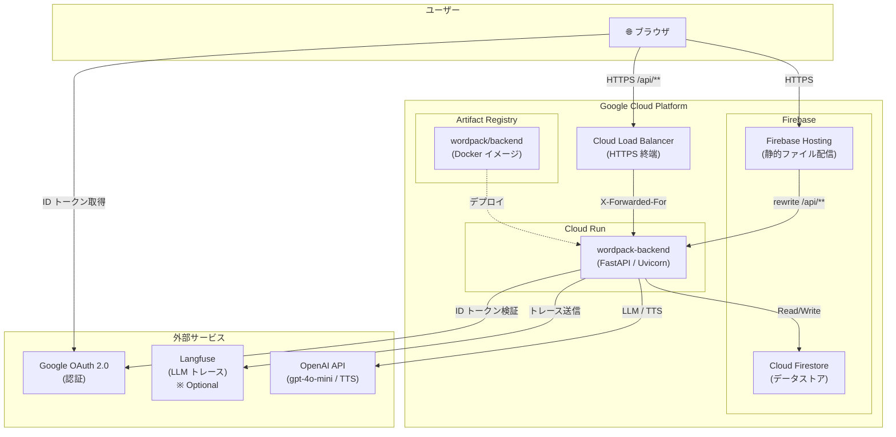
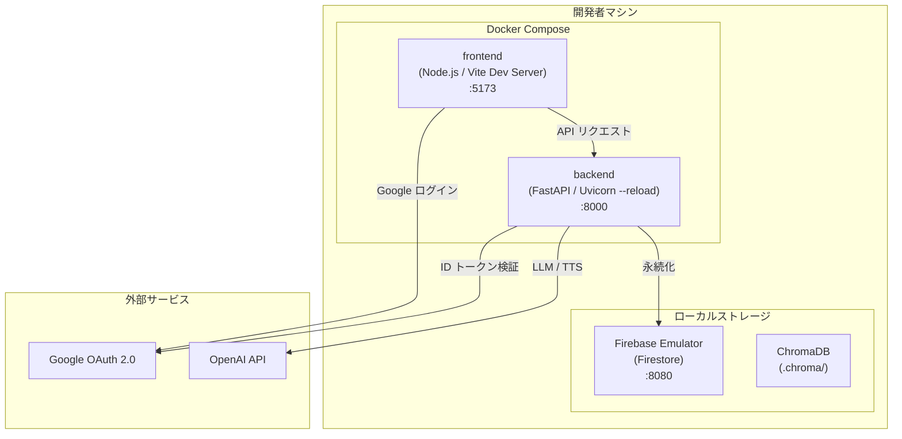
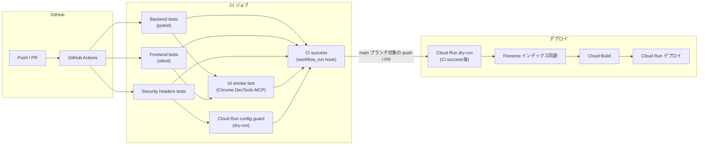
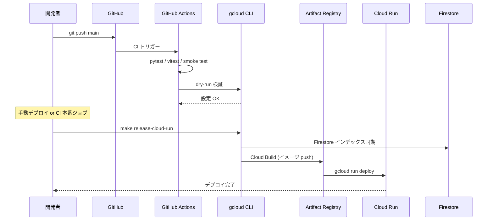
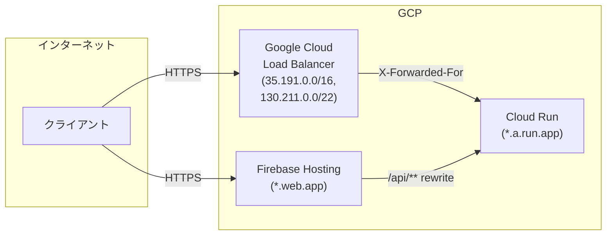
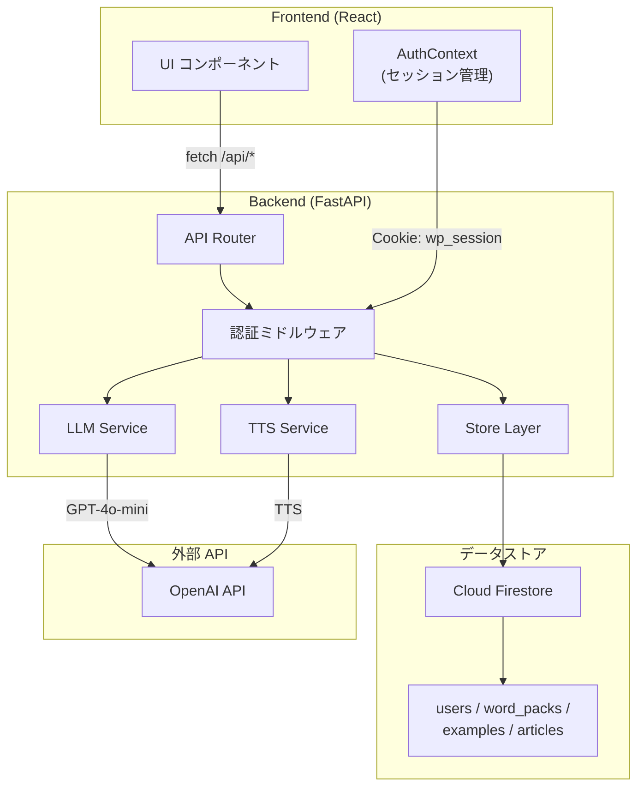

# インフラ構成図

WordPack for English のインフラ構成を示す。

---

## 本番環境（Production）



### コンポーネント説明

| コンポーネント | 役割 |
|---------------|------|
| **Firebase Hosting** | React + Vite でビルドした静的ファイルを配信。`/api/**` へのリクエストを Cloud Run へリライト。 |
| **Cloud Run** | FastAPI バックエンドを実行。`Dockerfile.backend` でビルドしたイメージをデプロイ。 |
| **Cloud Firestore** | ユーザー情報・WordPack・例文・インポート記事を永続化。ゲスト閲覧用のデモデータは `word_packs.metadata.guest_demo=true` で識別する。`firestore.indexes.json` で複合インデックスを管理。 |
| **Artifact Registry** | Cloud Build でビルドした Docker イメージを保存。 |
| **Cloud Load Balancer** | HTTPS 終端と `X-Forwarded-For` によるクライアント IP 復元。 |
| **OpenAI API** | WordPack 生成（gpt-4o-mini）と音声読み上げ（gpt-4o-mini-tts）。 |
| **Google OAuth 2.0** | フロントエンドでの Google ログイン。バックエンドで ID トークンを検証しセッション発行。 |
| **Langfuse** | LLM のプロンプト・レスポンスをトレース（任意設定）。 |

---

## ローカル開発環境



### 起動コマンド

```bash
# Docker Compose で一括起動
docker compose up --build

# または個別起動
# Backend
python -m uvicorn backend.main:app --reload --app-dir apps/backend

# Frontend
cd apps/frontend && npm run dev
```

### 環境変数による切り替え

| ENVIRONMENT | データストア | 用途 |
|-------------|-------------|------|
| `development` | Firestore Emulator (`FIRESTORE_EMULATOR_HOST`) | ローカル開発 |
| `production` | Cloud Firestore | 本番 |

---

## CI/CD パイプライン



### CI ジョブ一覧

| ジョブ名 | トリガー | 内容 |
|---------|---------|------|
| **Backend tests** | push / PR | `PYTHONPATH=apps/backend` で `pytest` を実行し、`pytest.ini` の `addopts` に揃えた `apps/backend/backend` のカバレッジが 60% 以上であることを検証 |
| **Security headers tests** | push / PR | セキュリティヘッダー検証（HSTS, CSP, etc.） |
| **Frontend tests** | push / PR | `vitest --coverage` によるフロントエンドテストと、lines/statements 80%、branches 70%、functions 80% のカバレッジ閾値チェック |
| **UI smoke test** | Backend / Frontend テスト成功後 | Chrome DevTools MCP を用いた E2E スモークテスト |
| **Cloud Run config guard** | Security headers 成功後 | デプロイスクリプトの lint と dry-run 検証 |
| **Cloud Run dry-run** | CI 成功後の workflow_run（main 向け push / PR のみ） | CI が成功した際に `make release-cloud-run` の dry-run モードを実行。fork からの PR でシークレットが無い場合は notice を残してスキップ |
| **Deploy to production** | CI 成功後の workflow_run（main 向け push のみ） | CI が成功した際に、本番用シークレットから `.env.deploy` を復元して `make release-cloud-run` を実行（CI が検証した commit SHA をデプロイ） |

Cloud Run dry-run は CI の全ジョブが success になった後の workflow_run イベントでのみ起動し、main ブランチへの push または base が main の PR に限定される。fork からの PR などでシークレットを利用できない場合は CI 成功後でも dry-run をスキップし、notice ログで未検証であることを明示する。

---

## デプロイフロー



### デプロイコマンド

```bash
# Firestore インデックス同期 → dry-run → 本番デプロイ
make release-cloud-run \
  PROJECT_ID=my-prod-project \
  REGION=asia-northeast1 \
  ENV_FILE=.env.deploy
```

---

## ネットワーク構成



### セキュリティ設定

| 設定項目 | 環境変数 | 説明 |
|---------|---------|------|
| **CORS** | `CORS_ALLOWED_ORIGINS` | 許可するフロントエンドオリジン |
| **信頼プロキシ** | `TRUSTED_PROXY_IPS` | X-Forwarded-For を信頼する CIDR |
| **許可ホスト** | `ALLOWED_HOSTS` | TrustedHostMiddleware で許可するホスト名 |
| **HSTS** | `SECURITY_HSTS_MAX_AGE_SECONDS` | HTTP Strict Transport Security の max-age |
| **CSP** | `SECURITY_CSP_DEFAULT_SRC` | Content Security Policy の default-src |

---

## データフロー



---

## 参照

- [README.md](../README.md) - セットアップ手順・環境変数の詳細
- [docs/環境変数の意味.md](./環境変数の意味.md) - 環境変数の一覧と説明
- [docs/flows.md](./flows.md) - API フロー図
- [docs/models.md](./models.md) - データモデル定義
- [firestore.indexes.json](../firestore.indexes.json) - Firestore インデックス定義
