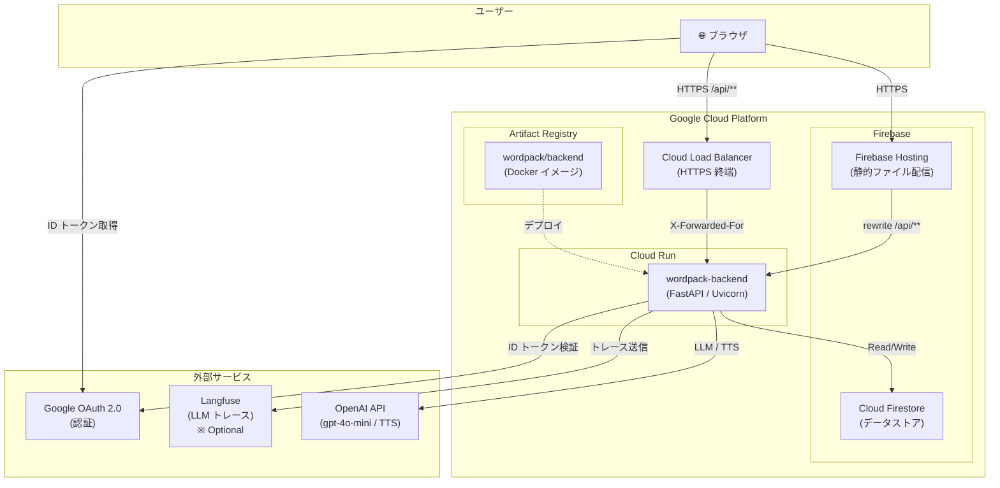
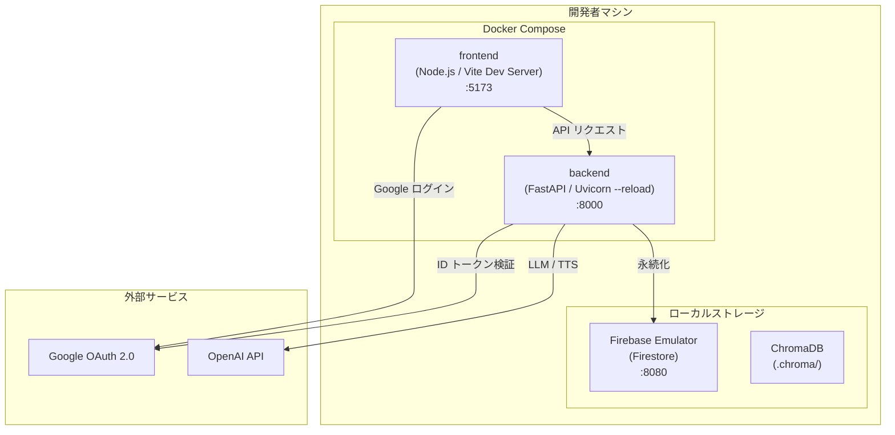
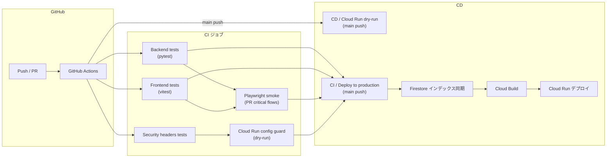
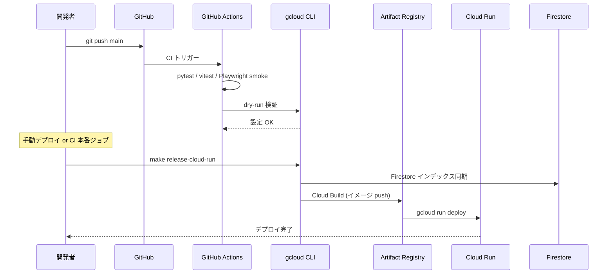
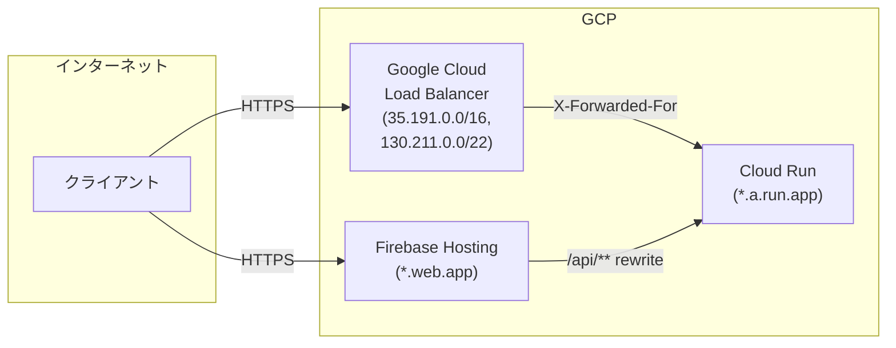
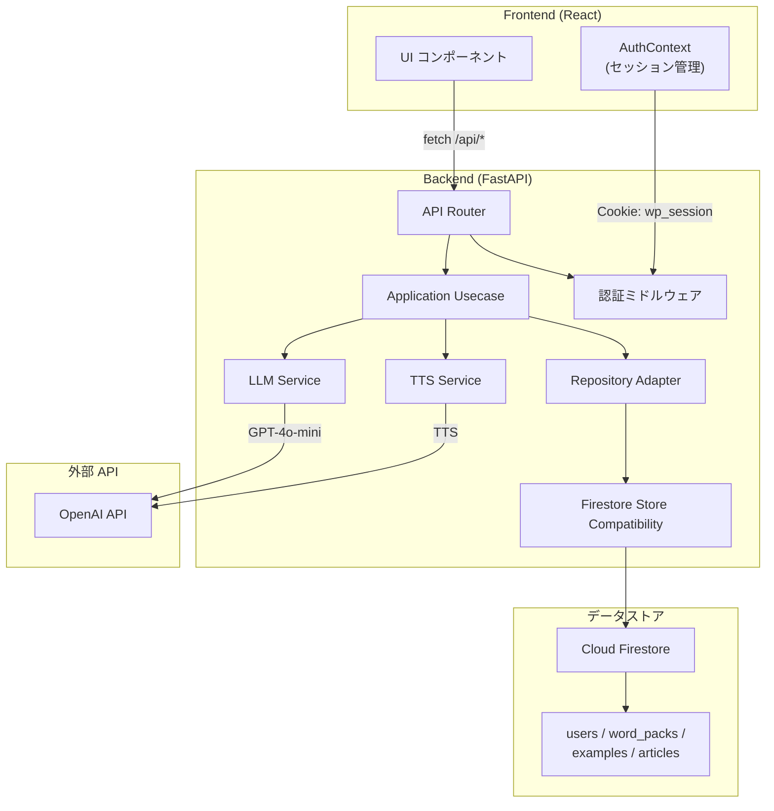

# インフラ構成図

WordPack for English のインフラ構成を示す。

---

## 本番環境（Production）


```mermaid
flowchart TB
    subgraph Users["ユーザー"]
        Browser["🌐 ブラウザ"]
    end

    subgraph GCP["Google Cloud Platform"]
        subgraph Firebase["Firebase"]
            Hosting["Firebase Hosting<br/>(静的ファイル配信)"]
            Firestore["Cloud Firestore<br/>(データストア)"]
        end

        subgraph CloudRun["Cloud Run"]
            Backend["wordpack-backend<br/>(FastAPI / Uvicorn)"]
        end

        subgraph ArtifactRegistry["Artifact Registry"]
            DockerImage["wordpack/backend<br/>(Docker イメージ)"]
        end

        LB["Cloud Load Balancer<br/>(HTTPS 終端)"]
    end

    subgraph External["外部サービス"]
        OpenAI["OpenAI API<br/>(gpt-4o-mini / TTS)"]
        GoogleOAuth["Google OAuth 2.0<br/>(認証)"]
        Langfuse["Langfuse<br/>(LLM トレース)<br/>※ Optional"]
    end

    Browser -->|HTTPS| Hosting
    Browser -->|HTTPS /api/**| LB
    LB -->|X-Forwarded-For| Backend
    Hosting -->|rewrite /api/**| Backend
    Backend -->|Read/Write| Firestore
    Backend -->|LLM / TTS| OpenAI
    Backend -->|トレース送信| Langfuse
    Browser -->|ID トークン取得| GoogleOAuth
    Backend -->|ID トークン検証| GoogleOAuth
    DockerImage -.->|デプロイ| Backend
```

### コンポーネント説明

| コンポーネント | 役割 |
|---------------|------|
| **Firebase Hosting** | React + Vite でビルドした静的ファイルを配信。`/api/**` へのリクエストを Cloud Run へリライト。 |
| **Cloud Run** | FastAPI バックエンドを実行。`Dockerfile.backend` でビルドしたイメージをデプロイ。 |
| **Cloud Firestore** | ユーザー情報・WordPack・例文・インポート記事を永続化。ゲスト閲覧用のデモデータは `word_packs.metadata.guest_demo=true` で識別する。`firestore.indexes.json` で複合インデックスを管理。 |
| **Artifact Registry** | Cloud Build でビルドした Docker イメージを保存。 |
| **Cloud Load Balancer** | HTTPS 終端と `X-Forwarded-For` によるクライアント IP 復元。 |
| **OpenAI API** | WordPack 生成（gpt-4o-mini）と音声読み上げ（gpt-4o-mini-tts）。 |
| **Google OAuth 2.0** | フロントエンドでの Google ログイン。バックエンドで ID トークンを検証しセッション発行。 |
| **Langfuse** | LLM のプロンプト・レスポンスをトレース（任意設定）。 |

---

## ローカル開発環境


```mermaid
flowchart TB
    subgraph Dev["開発者マシン"]
        subgraph DockerCompose["Docker Compose"]
            FrontendContainer["frontend<br/>(Node.js / Vite Dev Server)<br/>:5173"]
            BackendContainer["backend<br/>(FastAPI / Uvicorn --reload)<br/>:8000"]
        end

        subgraph Local["ローカルストレージ"]
            FirestoreEmulator["Firebase Emulator<br/>(Firestore)<br/>:8080"]
            ChromaDB["ChromaDB<br/>(.chroma/)"]
        end
    end

    subgraph External["外部サービス"]
        OpenAI["OpenAI API"]
        GoogleOAuth["Google OAuth 2.0"]
    end

    FrontendContainer -->|API リクエスト| BackendContainer
    BackendContainer -->|永続化| FirestoreEmulator
    BackendContainer -->|LLM / TTS| OpenAI
    FrontendContainer -->|Google ログイン| GoogleOAuth
    BackendContainer -->|ID トークン検証| GoogleOAuth
```

### 起動コマンド

```bash
# Docker Compose で一括起動
docker compose up --build

# または個別起動
# Backend
python -m uvicorn backend.main:app --reload --app-dir apps/backend

# Frontend
cd apps/frontend && npm run dev
```

### 環境変数による切り替え

| ENVIRONMENT | データストア | 用途 |
|-------------|-------------|------|
| `development` | Firestore Emulator (`FIRESTORE_EMULATOR_HOST`) | ローカル開発 |
| `production` | Cloud Firestore | 本番 |

---

## CI/CD パイプライン


```mermaid
flowchart LR
    subgraph GitHub["GitHub"]
        Push["Push / PR"]
        Actions["GitHub Actions"]
    end

    subgraph CI["CI ジョブ"]
        BackendTest["Backend tests<br/>(pytest)"]
        SecurityTest["Security headers tests"]
        FrontendTest["Frontend tests<br/>(vitest)"]
        PlaywrightSmoke["Playwright smoke<br/>(PR critical flows)"]
        CloudRunGuard["Cloud Run config guard<br/>(dry-run)"]
    end

    subgraph CD["CD"]
        DryRun["CD / Cloud Run dry-run<br/>(main push)"]
        ProductionDeploy["CI / Deploy to production<br/>(main push)"]
        FirestoreIndex["Firestore インデックス同期"]
        CloudBuild["Cloud Build"]
        CloudRun["Cloud Run デプロイ"]
    end

    Push --> Actions
    Actions --> BackendTest
    Actions --> SecurityTest
    Actions --> FrontendTest
    BackendTest --> PlaywrightSmoke
    FrontendTest --> PlaywrightSmoke
    SecurityTest --> CloudRunGuard
    Actions -->|main push| DryRun
    BackendTest --> ProductionDeploy
    FrontendTest --> ProductionDeploy
    PlaywrightSmoke --> ProductionDeploy
    CloudRunGuard --> ProductionDeploy
    ProductionDeploy --> FirestoreIndex
    FirestoreIndex --> CloudBuild
    CloudBuild --> CloudRun
```

### CI ジョブ一覧

| ジョブ名 | トリガー | 内容 |
|---------|---------|------|
| **Backend tests** | push / PR | `PYTHONPATH=apps/backend` で `pytest` を実行し、`pytest.ini` の `addopts` に揃えた `apps/backend/backend` のカバレッジが 60% 以上であることを検証 |
| **Security headers tests** | push / PR | セキュリティヘッダー検証（HSTS, CSP, etc.） |
| **Frontend tests** | push / PR | `vitest --coverage` によるフロントエンドテストと、lines/statements 80%、branches 70%、functions 66% のカバレッジ閾値チェック（functions は段階的に 70%→75%→80% へ引き上げ予定） |
| **Playwright smoke** | `pull_request`（Backend / Frontend テスト成功後） | Playwright の主要導線スモークテスト（`auth.spec.ts` / `guest.spec.ts` / `wordpack.spec.ts`） |
| **Visual regression** | `pull_request`（UI 変更のみ） | UI 変更が検知された場合に Playwright の視覚回帰 (`tests/e2e/visual.spec.ts`) を実行 |
| **Cloud Run config guard** | Security headers 成功後 | デプロイスクリプトの lint と dry-run 検証 |
| **Cloud Run dry-run** | `main` push | `CD / Cloud Run dry-run` として main に取り込まれた commit のチェック一覧に表示し、`make release-cloud-run` の dry-run モードを実行 |
| **Deploy to production** | CI の main push または `deploy-production.yml` の手動実行 | main への push では CI 内の `deploy_production` job が backend/frontend/Playwright/config guard 成功後に実行される。手動フォールバックとして `deploy-production.yml` の `workflow_dispatch` も残す |

Cloud Run dry-run は `main` ブランチへの push で直接起動し、GitHub のコミットチェック一覧に CD の状態を表示する。PR では実行せず、マージ前のデプロイ検証は CI 内の Cloud Run config guard に限定する。`Deploy to production` は main ブランチへの push を契機に起動するため、CI 成功を必須にする場合は main ブランチ保護でチェックを必須化する。

CD のチェック表示は GitHub Actions と Cloud Build の二経路で行う。main への push では CI ワークフロー内の `deploy_production` job が実行され、手動リリース時は `Deploy to production` ワークフローを `workflow_dispatch` で起動する。Cloud Build は `cloudbuild.backend.yaml` 内で GitHub Checks API に結果を送信する。手動リリースでは `deploy-production.yml` から `GITHUB_CHECKS_TOKEN` を渡すことで、Cloud Build の成功結果もコミットチェック一覧に追加される。

### E2E 実行レイヤ（Playwright）

Playwright の E2E は実行レイヤごとにスコープとブラウザを分離する。PR では最短のスモークのみを CI に含め、回帰は schedule（cron）または手動実行（workflow_dispatch）で起動する専用ワークフローで扱う。

| レイヤ | トリガー | ブラウザ | 実行コマンド | 成果物 |
|---|---|---|---|---|
| PR スモーク | `pull_request` | Chromium | `npx playwright test -c tests/e2e/playwright.config.ts tests/e2e/auth.spec.ts tests/e2e/guest.spec.ts tests/e2e/wordpack.spec.ts` | `playwright-report/`, `test-results/` |
| PR ビジュアル回帰 | `pull_request`（`apps/frontend/src/**`, `apps/frontend/**/*.css`, `apps/frontend/**/*.tsx` の変更時） | Chromium | `npx playwright test -c tests/e2e/playwright.config.ts tests/e2e/visual.spec.ts` | `playwright-report/`, `test-results/` |
| 夜間回帰 | `schedule (cron: 0 2 * * *)` / `workflow_dispatch` | Chromium | `npx playwright test -c tests/e2e/playwright.config.ts --browser=chromium` | `playwright-report/`, `test-results/` |
| 週次クロスブラウザ | `schedule (cron: 0 3 * * 1)` / `workflow_dispatch` | Firefox / WebKit | `npx playwright test -c tests/e2e/playwright.config.ts --browser=firefox` / `npx playwright test -c tests/e2e/playwright.config.ts --browser=webkit` | `playwright-report/`, `test-results/` |

各レイヤの実行前に `npx playwright install --with-deps` を実行してブラウザを取得する。成果物は GitHub Actions の Artifacts として 90 日保持する。ビジュアル回帰の差分画像や HTML レポートは対象ワークフローの実行画面から `playwright-report/` と `test-results/` をダウンロードして確認する。

---

## デプロイフロー


```mermaid
sequenceDiagram
    participant Dev as 開発者
    participant GitHub as GitHub
    participant Actions as GitHub Actions
    participant GCloud as gcloud CLI
    participant AR as Artifact Registry
    participant CR as Cloud Run
    participant FS as Firestore

    Dev->>GitHub: git push main
    GitHub->>Actions: CI トリガー
    Actions->>Actions: pytest / vitest / Playwright smoke
    Actions->>GCloud: dry-run 検証
    GCloud-->>Actions: 設定 OK

    Note over Dev: 手動デプロイ or CI 本番ジョブ
    Dev->>GCloud: make release-cloud-run
    GCloud->>FS: Firestore インデックス同期
    GCloud->>AR: Cloud Build (イメージ push)
    AR->>CR: gcloud run deploy
    CR-->>Dev: デプロイ完了
```

### デプロイコマンド

```bash
# Firestore インデックス同期 → dry-run → 本番デプロイ
make release-cloud-run \
  PROJECT_ID=my-prod-project \
  REGION=asia-northeast1 \
  ENV_FILE=.env.deploy
```

---

## ネットワーク構成


```mermaid
flowchart LR
    subgraph Internet["インターネット"]
        Client["クライアント"]
    end

    subgraph GCP["GCP"]
        GLB["Google Cloud<br/>Load Balancer<br/>(35.191.0.0/16,<br/>130.211.0.0/22)"]
        Hosting["Firebase Hosting<br/>(*.web.app)"]
        CR["Cloud Run<br/>(*.a.run.app)"]
    end

    Client -->|HTTPS| GLB
    GLB -->|X-Forwarded-For| CR
    Client -->|HTTPS| Hosting
    Hosting -->|/api/** rewrite| CR
```

### セキュリティ設定

| 設定項目 | 環境変数 | 説明 |
|---------|---------|------|
| **CORS** | `CORS_ALLOWED_ORIGINS` | 許可するフロントエンドオリジン |
| **信頼プロキシ** | `TRUSTED_PROXY_IPS` | X-Forwarded-For を信頼する CIDR |
| **許可ホスト** | `ALLOWED_HOSTS` | TrustedHostMiddleware で許可するホスト名 |
| **HSTS** | `SECURITY_HSTS_MAX_AGE_SECONDS` | HTTP Strict Transport Security の max-age |
| **CSP** | `SECURITY_CSP_DEFAULT_SRC` | Content Security Policy の default-src |

---

## データフロー


```mermaid
flowchart TB
    subgraph Frontend["Frontend (React)"]
        UI["UI コンポーネント"]
        AuthContext["AuthContext<br/>(セッション管理)"]
    end

    subgraph Backend["Backend (FastAPI)"]
        Router["API Router"]
        Usecase["Application Usecase"]
        Auth["認証ミドルウェア"]
        LLMService["LLM Service"]
        TTSService["TTS Service"]
        Repository["Repository Adapter"]
        Store["Firestore Store Compatibility"]
    end

    subgraph Data["データストア"]
        Firestore["Cloud Firestore"]
        Collections["users / word_packs /<br/>examples / articles"]
    end

    subgraph External["外部 API"]
        OpenAI["OpenAI API"]
    end

    UI -->|fetch /api/*| Router
    Router --> Auth
    Router --> Usecase
    Usecase --> LLMService
    Usecase --> TTSService
    Usecase --> Repository
    Repository --> Store
    LLMService -->|GPT-4o-mini| OpenAI
    TTSService -->|TTS| OpenAI
    Store --> Firestore
    Firestore --> Collections
    AuthContext -->|Cookie: wp_session| Auth
```

---

## 参照

- [README.md](../README.md) - セットアップ手順・環境変数の詳細
- [docs/環境変数の意味.md](./環境変数の意味.md) - 環境変数の一覧と説明
- [docs/flows.md](./flows.md) - API フロー図
- [docs/models.md](./models.md) - データモデル定義
- [firestore.indexes.json](../firestore.indexes.json) - Firestore インデックス定義
